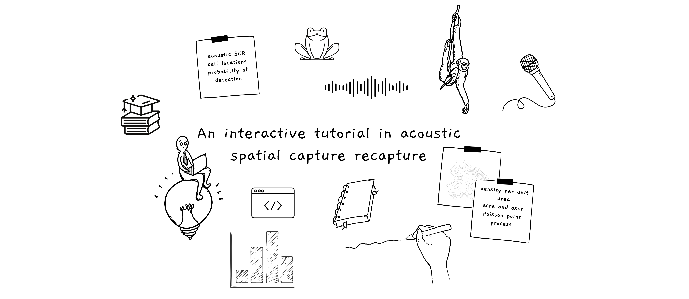

```{r setup, include=FALSE}

library(shiny)

# load images for plotting
frog_image <- "images/frogGraphic.png"
micro_image <- "images/micro.png"

source("RScripts/PROBD_Setup.R")
source("RScripts/SCR_Setup.R")
source("RScripts/Chapter5_Setup.R")

```

```{sass, echo = FALSE}
$color1: #668BA4
$color2: #FEFFDF
div
  &.learnBox
    border-color: $color1
    border-style: solid
    background-color: rgba(151, 203, 169,.5)
    width: 100%
    padding: 0.5em
    border-radius: 10px
    margin: 0 auto 
    strong
      color: $color1
      
      div
  &.defBox
    border-color: $color1
    border-style: solid
    width: 100%
    padding: 0.5em
    border-radius: 5px
    margin: 0 auto 
    strong
      color: black

```

## Welcome!

Step into the world of acoustic spatial capture-recapture (aSCR) with this <a href="https://rstudio.github.io/learnr/" target="_blank"> learnr </a> tutorial. My name is Ané Cloete, and I'm excited to share this tutorial with you, which I developed as part of my Master's dissertation at the University of St Andrews in Scotland.

```{r,echo=FALSE,out.width="100%",fig.align="center"}

 

```

Acoustic SCR has emerged as a fresh and promising approach in statistical ecology. Despite its potential, the pace of its integration into the field has been relatively slow. I believe one key reason is the limited availability of accessible educational resources. This tutorial aims to bridge that gap by providing an educational platform that simplifies the aSCR methodology for practitioners without an extensive statistical background.

### Who are you?

This tutorial is tailor-made for practitioners in the field of ecology or anyone eager to embark on a journey into the aSCR methodology and its implementation using R. Unlike some dry academic lectures, you won't find any bewildering terms like "likelihood" or "probability distribution function" here. We're all about clarity and simplicity.

It's good to have a grasp of some basic statistical concepts like samples, estimates, standard errors, and confidence intervals. If these concepts are slightly hazy, fear not--- I've sprinkled concise explanations throughout the tutorial and in the definitions list to keep you on track. But a little refresher wouldn't hurt, so take a peek at the resources I've listed below.

Furthermore, a bit of familiarity with R will come in handy. You don't need to be an R maestro, but a modest understanding will ensure a smoother experience. If you're new to R, no worries--- there are links to some excellent introductory resources to get you started.

Lastly, I'd like to re-emphasize that this is an introductory course. If you're seeking an in-depth explanation of aSCR model formulations and underlying assumptions, you won't find it here. However, it's worth noting that I envision a future chapter that delves into these intricasies and attempts to explain them simplistically, potentially as an advanced extension of this tutorial. While that's a potential endeavor on the horizon, the primary objective of this tutorial remains to provide you with a non-statistical introduction to the aSCR methodology and its practical implementation using R. Additionally, the planned tutorial includes two additional chapter(s) on animal density and group density (these will become clearer later) but for the purposes of the dissertation, only Chapters 1 to 5 were developed. 

### Chapter outline and structure

[**1 Introduction**]{.underline} <font size="1" color = "#959595" > Reading time: 4 minutes </font>

-   Introduction to acoustic spatial capture-recapture in the context of estimating animal abundance
-   Summary

[**2 Probability of detection**]{.underline} <font size="1" color = "#959595" > Reading time: 7 minutes  </font> 

-   Probability of detection & basic capture-recapture analysis
-   Distance dependent detection
-   Summary

[**3 Introduction to SCR**]{.underline} <font size="1" color = "#959595" > Reading time: 11 minutes </font>

-   Survey structure
-   Model structure
-   Quiz
-   Summary

[**4 Overview of aSCR**]{.underline} <font size="1" color = "#959595" > Reading time: 9 minutes </font>

-   Detection units
-   Calling density
-   Animal density
-   Group density
-   Summary

[**5 aSCR Calling Density (aSCR-CD)**]{.underline} <font size="1" color = "#959595" > Reading time: 24 minutes </font>

-   Introduction to the $\texttt{acre}$ package
-   Pre-$\texttt{acre}$
-   $\texttt{acre}$-formatting
-   Model fitting
-   Inference 
-   Exercise 1 
-   Exercise 2 
-   Summary 

[**Definitions**]{.underline}

- List of definitions

### How to use this tutorial (and some other things)

#### Summaries and definitions 

Throughout the tutorial, some words are in bold and blue. These are the words that are defined in the last section. 

As you can see, each chapter concludes with a summary of the key points taught. It will look something like this:

::: learnBox
**Summary:**

-   Key point

-   Key point
:::

<br/>

The tutorial is built to progress from chapter to chapter (although you can skip a chapter if you want). The summary contains the key concepts and points to understand before moving on the next chapter.

#### Exercises and quizzes 

In Chapter 5, we start to code in R using "code blocks", like this one below. Either the code blocks with already have code in for you to run with the **Run code** button and play around with or it will be left empty for you to write your own code. In the latter case, you'll be able to get help through either a hint or examining the solution (below a hint is included, but solutions will appear in the same way). At any point, you can click **Start over** to clear the code block and restart from scratch. When you press **Run code** the output will appear below the code block. 

```{r example, exercise=TRUE,exercise.eval=FALSE}

# some code

```

```{r example-hint}
# a hint 
```


At the end of Chapter 3, I've included a short multiple choice quiz on the material taught so far. Just to make sure we understand some of the important bits so far, but don't worry it's not a compulsory quiz and you can skip it completely if you want. Some questions have multiple answers while other have just one. 

#### Shiny apps

Throughout the tutorial there are interactive graphs and environments which will (hopefully) help you to engage with the material (and also, its for fun). Each interactive environment was created with <a href="https://shiny.posit.co/" target="_blank"> Shiny </a> (a very cool package that allows R coders to create web applications) and how to use them will be explained in the relevant Chapter.

#### The acre package

Nowhere in the tutorial are you required to run your own code on your own system. This is what's so neat about learnr tutorials! However, if you want to follow along with the R analysis presented in Chapter 5, you have to install the following packages:

-   acre
-   ascr
-   secr
-   tidyverse

The last two packages you can install with base R, i.e. install.packages("package_name"). Both the acoustic SCR packages, acre and ascr, require you to install them from github with the package devtools. Here is R code you can use to install the packages:

```{r pack,eval=FALSE}

install.packages(c("tidyverse","secr","devtools"))

library(tidyverse)
library(secr)
library(devtools)

install_github("b-steve/ascr")
install_github("b-steve/acre")

library(acre)
library(ascr)

```

The main package for implementing aSCR models is the $\texttt{acre}$ package, but the other aSCR package, $\texttt{ascr}$, contains the data we use in for analysis, so you'll need to install it too. We never fit any models with the ascr package, if you'd like to do that you will have to install a specific model builder on your computer and you can find instructions on how to that on the package github repository, <a href="https://github.com/b-steve/ascr" target="_blank"> here </a>.

### Resources

#### Introductory R resources and other R resources

-  <a href="https://cran.r-project.org/doc/manuals/R-intro.pdf" target="_blank"> Introduction to R from CRAN</a>
-   <a href="https://www.youtube.com/watch?v=_V8eKsto3Ug" target = "_blank"> Youtube video on R </a>
-   <a href="https://www.w3schools.com/r/r_syntax.asp" target="_blank"> Website on R</a>
-   <a href="https://r4ds.hadley.nz/" target="_blank"> Tidyverse in R </a>
-   <a href="https://mastering-shiny.org/" target="_blank"> Shiny in R </a>

#### Introductory Statistics resources

-   <a href="https://courses.lumenlearning.com/introstats1/" target="_blank"> Introductory course</a>, specifically modules 1, 8, 12 and 14
-   <a href="https://ecampusontario.pressbooks.pub/introstats/" target="_blank"> Introductory course</a>, specifically sections 1, 7, 12 and 13 
-   <a href="https://www.youtube.com/watch?v=kyjlxsLW1Is&t=1669s" target="_blank"> Crash course video</a>


#### SCR Resources


-   <a href="https://kevintshoemaker.github.io/NRES-746/SCR.html" target="_blank"> A tutorial on SCR video </a>
-  <a href="https://youtu.be/yRRDi07FtPg" target="_blank"> A video series on SCR </a>
- <a href="https://shop.elsevier.com/books/spatial-capture-recapture/royle/978-0-12-405939-9" target="_blank"> This </a> is a great book for SCR, but it's not freely available.
- <a href="https://www.otago.ac.nz/density/pdfs/secr-tutorial.pdf" target="_blank"> Tutorial </a> on the implementation of SCR models. 

### The full thesis

This tutorial comprises 50% of my portfolio dissertation. The rest consisted of an academically focused report, a reflective essay and presentation. If you like, you can access the written components below.

```{r echo=FALSE}

xfun::embed_file("Masters_Dissertation_Report.pdf")

```

<br/>
That's it! Let's begin :) 

```{r, child='01_INTRO.Rmd'}
```

```{r, child='02_PROBD.Rmd'}
```

```{r, child='03_SCR.Rmd'}
```

```{r, child='04_ASCR.Rmd'}
```

```{r, child='05_ASCRCD.Rmd'}
```

```{r, child='06_DEF.Rmd'}
```

