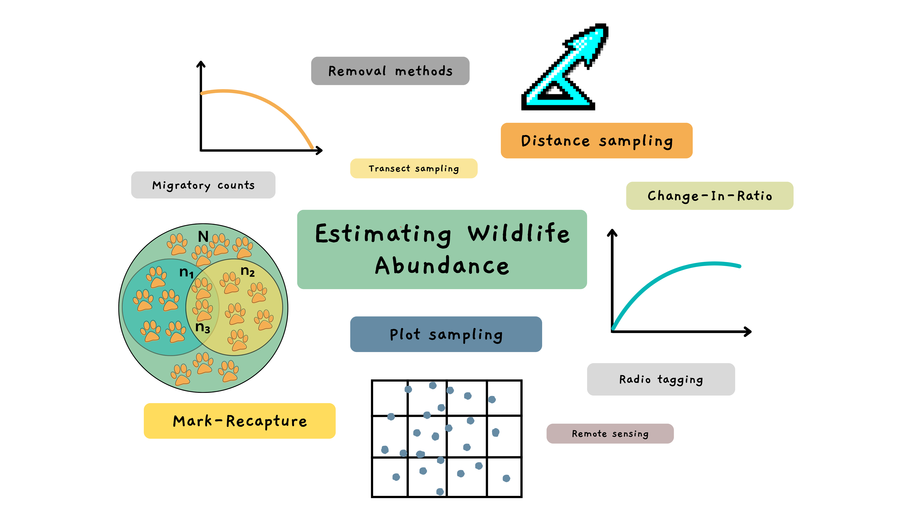

```{r setup1, include=FALSE}

# NB if you want to run the chapter on its own, remove the number after setup in the chunk name


```

## 1 Introduction 

Understanding wildlife populations is super important when it comes to ecological research and conservation. Specifically, knowing how many individuals make up a population allows us to identify significant changes that might lead to extinction, effectively manage populations and motivate for change in policies and behavior.  But calculating [abundance]{style="color:#668BA4;font-weight:bold;"} and [density]{style="color:#668BA4;font-weight:bold;"} of a population is not that easy, it is nearly impossible to count all individuals in a wildlife population. So over the years, scientists have come up with many different ways to [estimate]{style="color:#668BA4;font-weight:bold;"} abundance, like plot sampling, removal methods, change-in-ratio, distance sampling, and capture-recapture methods. Using these methods, we end up with a subset of the actual population otherwise known as a [sample]{style="color:#668BA4;font-weight:bold;"}.  
  
```{r,echo=FALSE,out.width="75%",fig.align="center"} 

 
```

The last two methods, [distance sampling]{style="color:#668BA4;font-weight:bold;"} (DS) and [capture-recapture]{style="color:#668BA4;font-weight:bold;"} methods (CR), are very popular methods. DS typically relies on spotting animals, whereas CR is an analytical framework that can be used in conjunction with a variety of methods for capturing or detecting animals, broadly referred to here as [sampling or survey techniques]{style="color:#668BA4;font-weight:bold;"}. These survey techniques record captures and recaptures of animals and historically, required physically capturing animals (hence the terminology). In recent decades, however, other cool survey techniques such as camera trapping and DNA sampling have been developed and people have started to use the terms detections and redetections as well. Although which word pair is more appropriate depends on the survey technique, people tend to use the terms interchangeably.  

Another innovative method is acoustic surveying. It is a practical and budget-friendly option that works incredibly well for certain wildlife populations. Acoustic surveying, specifically [passive acoustic surveying]{style="color:#668BA4;font-weight:bold;"}, involves placing microphones or any kind of self-contained recording unit (also known as autonomous recording units or ARUs for brevity), throughout a marine or terrestrial environment to record animal calls (sometimes called cues or vocalisations). The collected audio data are then processed using various techniques, such as by expert knowledge, machine learning algorithms, or pattern recognition software, to detect the specific sounds of the species of interest. So naturally, this technique can only be used for animals that are acoustically active and make some kind of identifiable sound. It's an incredibly useful technique for species that aren’t easy to see but do call often, such as the rare and elusive <a href="https://www.youtube.com/watch?v=COQF0ZI0yKY" target="_blank"> vaquita species</a> (a really cute porpoise that is in need of some serious conservation) and many other marine mammals. Or animals that aren't active during the day and regularly call throughout the night, like this <a href="https://animalia.bio/edible-dormouse" target="_blank"> dormouse</a> or this <a href="https://dosits.org/galleries/audio-gallery/fishes/brown-meagre/" target="_blank"> brown meagre</a>. 

There are other benefits to acoustic surveying too. Weather conditions don’t massively dictate surveying, so a cloudy day won’t hinder your ability to spot an animal. For animals that make loud noises, you’ll likely cover a larger area as you’ll be able to record their calls from far away. Automated data collection is easy to implement as you can simply leave recording devices to do their thing, no need to stay out on the field all day. Recent advancements in algorithmic procedures for noise reduction, call recognition and identification have also made automated data processing more achievable. So, a lot more data can be collected and analysed with acoustic surveying and the more data, the better. Pretty cool right? 

Acoustic surveying lends itself towards the CR framework and consequently, CR [models]{style="color:#668BA4;font-weight:bold;"} have been developed specifically for data collected from acoustic surveys. In this tutorial, we'll cover these models and how to implement them in R but before that, we need to understand how our ability to detect animals depends on distance. 

::: learnBox
**Summary:** 

- We need to know how many animals there are in order to effectively conserve wildlife populations.
- Two common methods for estimating abundance and density are distance sampling and capture-recapture.
- Acoustic surveying is a sampling technique that involves recording animal vocalisations and works well within the CR framework. 
- Target species must produce calls that are identifiable.
- Advantages of acoustic surveying:

1. Relatively inexpensive and straightforward to implement
2. Powerful survey technique for visually cryptic species that produce loud or regular calls
3. Ability to operate independently of light conditions
4. Greater spatial range of detectability 
5. Lends itself towards automated data collection and processing
:::


