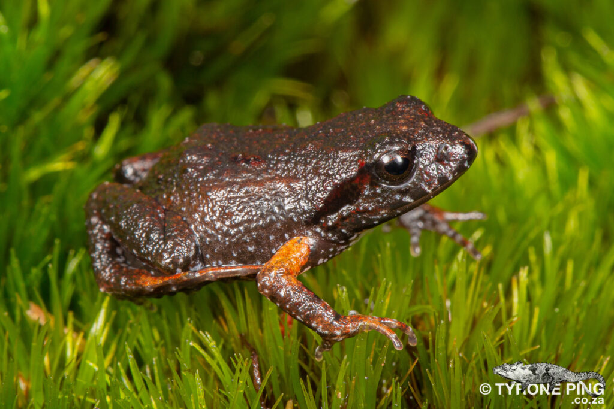

```{r setup2, include=FALSE}
# NB if you want to run the chapter on its own, remove the number after setup in the chunk name
knitr::opts_chunk$set(warning = FALSE, message = FALSE)

# source("RScripts/Chapter2_Setup.R")
```

## Probability of detection

In this tutorial, we assume that our wildlife population is closed. This means that during our survey, we assume that no new individuals are joining the population (births or immigration) or individuals leaving the population (deaths or emigration). In other words, we assume geographic and demographic closure. The alternative assumption is that the population is open, requiring a different analysis that has not yet been developed for acoustic surveys.

Regardless of our assumption, a key task is to estimate the [probability of detection]{style="color:#668BA4;font-weight:bold;"} - the probability that any individual in the population gets detected at all. This is because most surveys of wild populations are inherently **imperfect**. When estimating animal abundance, the probability of detection helps us know how many animals we did not detect. Knowing the probability of being in our sample enables us to determine the probability of NOT being in our sample. By estimating this probability, we take into account [ imperfect detection]{style="color:#668BA4;font-weight:bold;"} in our analysis, which would otherwise have produced inaccurate results.

Let's have a look at a traditional capture-recapture analysis with an example.

### Example: The Cape Moss Frog

In the Cape Peninsula of South Africa, this nifty little frog lives in leaf litter and among thickly vegetated mountain streams and river banks. It's the perfect specimen for acoustic surveying because despite the frog being super tiny (about 20-22mm), it can often be heard by its high-pitched call (although some people mistake it for a cricket).

```{r,echo=FALSE,out.width="35%", out.extra='style=" display: block; margin: 1em auto; border-radius: 2.5%;"'}

```

Let's imagine we want to estimate this frog population's density and place eight microphones throughout a patch of its habitat (see the arrangement below). Let's further imagine that we know the locations of the frogs in that patch (click the "Reveal Frogs" button) and that they each made one call. We may or may not detect (record) each of the calls made, and our microphones can detect multiple calls - click the "Survey!" button to see the resulting data collected.

The table below is a data frame consisting of [detection histories]{style="color:#668BA4;font-weight:bold;"}. Each row is a detection history of a call made and indicates at which microphone the call was recorded. An entry equal to "1" means that the call (i.e. row) was recorded at that microphone (i.e. column), and if not, the entry will be a zero. Click on one of the rows to show you the frog location and the microphones that detected the call. Below the detection history data, you'll also see the actual number of frogs ($N$), an estimate of the overall probability of detection ($p^*$) and an estimate of abundance that was calculated as follows:

$$
\text{Estimate of N } = \frac{\text{number of detected frogs}}{p^*}
$$ In the above formula, we are correcting for the number of frogs we missed by dividing by the overall probability of detecting an individual during the survey - that is, the probability of ever detecting an individual across all the microphones. To obtain $p^*$, we first calculate the probability of detecting an individual at a microphone ($p$) which we can calculate as the proportions of times we detected an individual (i.e. the proportion of 1s in our whole dataset). Then, the probability of missing an individual at a microphone is one minus $p$. But we have eight microphones, so the probability of missing an individual that many times is: $(1-p)^8$ and the complement of that is $p^* = 1-(1-p)^8$, the overall probability of detection.


```{r UI1, echo=FALSE}
fluidRow(
  column(
    6,
    actionButton("addBtn", "Reveal frogs", style = "color: #fff; background-color: #668ba4; border-color: #2e6da4"),
    actionButton("detBtn", "Survey!", style = "color: #fff; background-color: #668ba4; border-color: #2e6da4"),
    actionButton("startOverBtn", "Start Over", style = "color: #fff; background-color: #668ba4; border-color: #2e6da4"),
    style = "padding-left:23px;"
  ),
  column(6,
    actionButton("repeatBtn", "Repeat x 1000", style = "color: #fff; background-color: #668ba4; border-color: #2e6da4"),
    align = "right"
  )
)

fluidRow(
  column(6, plotOutput("frogPopPlot")),
  column(
    6, dataTableOutput("captHistData"),
    br(),
    fluidRow(
      valueBoxOutput("trueN", width = 4),
      valueBoxOutput("probD", width = 4),
      valueBoxOutput("estN", width = 4)
    )
  )
)


fluidRow(column(
  12,
  conditionalPanel(
    "input.repeatBtn%2 == 1",
    plotlyOutput("simPlot")
  )
))
```

```{r, context="server",echo=FALSE}
# Initial plot and empty dataframe

output$frogPopPlot <- renderPlot({
  ggplot() +
    geom_image(data = trapdf, aes(x = x, y = y, image = micro_image), size = 0.3) +
    xlim(-50, 150) +
    ylim(-50, 150) +
    theme_minimal() +
    theme(
      legend.position = "top",
      legend.title = element_blank(),
      panel.background = element_rect(fill = "#c1e0cb"),
      axis.title = element_blank(),
      axis.text = element_blank(),
      axis.ticks = element_blank(),
      panel.grid.minor = element_blank(),
      panel.grid.major = element_blank()
    )
})

output$captHistData <- DT::renderDT({
  empty_dat <- matrix(nrow = 10, ncol = 9)
  colnames(empty_dat) <- paste0("M", 1:9)

  datatable(empty_dat,
    rownames = TRUE,
    class = "cell-border",
    escape = FALSE,
    extensions = "Buttons",
    selection = "single",
    options = list(dom = "t", ordering = F)
  )
})

# metrics

output$trueN <- shinydashboard::renderValueBox({
  N <- 0
  shinydashboard::valueBox(N, "True number of calls")
})

output$estN <- shinydashboard::renderValueBox({
  shinydashboard::valueBox(0, "Estimated number of calls")
})

output$probD <- shinydashboard::renderValueBox({
  shinydashboard::valueBox(0, "Overall probability of detection")
})


# Create a reactive dataframe to store locations of frogs
points <- reactiveVal(data.frame(x = numeric(0), y = numeric(0)))
cpt_rv <- reactiveVal(NULL)

# Add frogs when the addBtn is clicked
observeEvent(input$addBtn, {
  temppop <- sim.popn(D = 5, expand.grid(x = c(0, 100), y = c(0, 100)), buffer = 50)
  popdf <- data.frame(temppop)

  points(temppop)

  # Render new plot with frogs
  output$frogPopPlot <- renderPlot({
    ggplot(points(), aes(x = x, y = y)) +
      geom_image(image = frog_image, colour = "#8A3A0D", size = 0.09) +
      geom_image(data = trapdf, aes(x = x, y = y, image = micro_image), size = 0.25) +
      xlim(-50, 150) +
      ylim(-50, 150) +
      geom_text(aes(label = rownames(points())), vjust = 0.5, hjust = 0.5, colour = "white", size = 4, fontface = "bold") +
      theme(
        legend.position = "top",
        legend.title = element_blank(),
        panel.background = element_rect(fill = "#c1e0cb"),
        axis.title = element_blank(),
        axis.text = element_blank(),
        axis.ticks = element_blank(),
        panel.grid.minor = element_blank(),
        panel.grid.major = element_blank()
      )
  })

  output$trueN <- shinydashboard::renderValueBox({
    N <- nrow(points())
    shinydashboard::valueBox(N, "Number of calls")
  })
})


# Add points when the button is clicked
observeEvent(input$detBtn, {
  if (is.null(points()) || nrow(points()) == 0) {
    # Display an error if points are empty
    showModal(modalDialog(
      title = "Oops!",
      "Please add frogs before surveying!",
      easyClose = TRUE
    ))
  } else {
    cpt <- sim.capthist(det_array,
      detectpar = list(g0 = 1, sigma = 20),
      noccasions = 1,
      popn = points(), renumber = FALSE
    )

    cpt_rv(cpt) # add to reactive dataframe for use outside observe

    prob_hist <- matrix(NA, nrow = dim(cpt)[1], ncol = dim(cpt)[3])
    rownames(prob_hist) <- names(cpt[, , 1])

    for (i in 1:9) {
      prob_hist[, i] <- cpt[, , i]
    }

    # # Calculate probabilities
    # prob_hist <- matrix(NA, nrow = nrow(points()), ncol = nrow(trapdf))
    # for (i in 1:nrow(trapdf)) {
    #   prob_hist[, i] <- calculate_prob_succ(points(), trapdf[i, ])
    # }

    det_ind <- as.data.frame(prob_hist)
    rownames(det_ind) <- paste("Frog", rownames(det_ind))
    colnames(det_ind) <- paste("M", 1:9)
    # det_ind <- det_ind[rowSums(det_ind[, 1:8]) > 0, ]

    output$captHistData <- DT::renderDT({
      det_ind %>%
        DT::datatable(
          rownames = TRUE,
          class = "cell-border",
          escape = FALSE,
          extensions = "Buttons",
          selection = "single",
          options = list(dom = "t", ordering = F)
        ) %>%
        formatStyle(0, target = "row", color = "black", lineHeight = "50%") %>%
        formatStyle(0, width = "20%")
    })


    # Render the plot
    output$frogPopPlot <- renderPlot({
      det_dat <- points() %>%
        mutate(
          det = ifelse(row_number() %in% rownames(cpt_rv()), "Detected", "Not Detected"),
          num = row_number()
        )

      ggplot(det_dat) +
        geom_image(aes(x = x, y = y, colour = det, image = frog_image), size = 0.09) +
        geom_image(data = trapdf, aes(x = x, y = y, image = micro_image), size = 0.25) +
        geom_text(aes(x = x, y = y, label = num), vjust = 0.5, hjust = 0.5, colour = "white", size = 4, fontface = "bold") +
        scale_color_manual(values = c(
          "Detected" = "darkgreen",
          "Not Detected" = "darkred"
        )) +
        xlim(-50, 150) +
        ylim(-50, 150) +
        theme(
          legend.position = "bottom",
          legend.title = element_blank(),
          panel.background = element_rect(fill = "#c1e0cb"),
          axis.title = element_blank(),
          axis.text = element_blank(),
          axis.ticks = element_blank(),
          panel.grid.minor = element_blank(),
          panel.grid.major = element_blank(),
          legend.text = element_text(size = 12)
        )
    })

    output$trueN <- shinydashboard::renderValueBox({
      N <- nrow(points())
      shinydashboard::valueBox(N, "True number of calls")
    })

    output$estN <- shinydashboard::renderValueBox({
      p_star <- 1 - (1 - mean(prob_hist))^nrow(det_array)
      Nhat <- nrow(det_ind) / p_star
      shinydashboard::valueBox(round(Nhat), "Estimated number of calls")
    })

    output$probD <- shinydashboard::renderValueBox({
      p_star <- 1 - (1 - mean(prob_hist))^nrow(det_array)
      shinydashboard::valueBox(round(p_star, 2), "Overall probability of detection")
    })
  }
})

# Reset to initial state when "Start Over" button is clicked
observeEvent(input$startOverBtn, {
  points(data.frame(x = numeric(0), y = numeric(0)))

  output$frogPopPlot <- renderPlot({
    ggplot() +
      geom_image(data = trapdf, aes(x = x, y = y, image = micro_image), size = 0.25) +
      xlim(-50, 150) +
      ylim(-50, 150) +
      theme(
        legend.position = "top",
        legend.title = element_blank(),
        panel.background = element_rect(fill = "#c1e0cb"),
        axis.title = element_blank(),
        axis.text = element_blank(),
        axis.ticks = element_blank(),
        panel.grid.minor = element_blank(),
        panel.grid.major = element_blank()
      )
  })

  output$simPlot <- renderPlot({
    NULL
  })

  output$captHistData <- DT::renderDT({
    empty_dat <- matrix(nrow = 10, ncol = 9)
    colnames(empty_dat) <- paste0("M", 1:9)

    datatable(empty_dat,
      rownames = TRUE,
      class = "cell-border",
      escape = FALSE,
      extensions = "Buttons",
      selection = "single",
      options = list(dom = "t", ordering = F)
    )
  })

  output$trueN <- shinydashboard::renderValueBox({
    N <- 0
    shinydashboard::valueBox(N, "True number of calls")
  })

  output$estN <- shinydashboard::renderValueBox({
    shinydashboard::valueBox(0, "Estimated number of calls")
  })

  output$probD <- shinydashboard::renderValueBox({
    shinydashboard::valueBox(0, "Overall probability of detection")
  })
})

# Simualtion

observeEvent(input$repeatBtn, {
  if (is.null(points()) || nrow(points()) == 0) {
    # Display an error if points are empty
    showModal(modalDialog(
      title = "Oops!",
      "Please add frogs before surveying!",
      easyClose = TRUE
    ))
  } else {
    showModal(modalDialog("Surveying!", footer = NULL))
    simulate_surveys <- function(points, micro, nsims = 1000) {
      nhats <- rep(0, nsims)
      for (i in 1:nsims) {
        # capture histories
        CH <- sim.capthist(micro,
          detectpar = list(g0 = 1, sigma = 20),
          noccasions = 1,
          popn = points, renumber = FALSE
        )

        CH_combined <- matrix(NA, nrow = dim(CH)[1], ncol = dim(CH)[3])
        rownames(CH_combined) <- names(CH[, , 1])

        for (j in 1:9) {
          CH_combined[, j] <- CH[, , j]
        }

        ave <- 1 - (1 - mean(CH_combined))^nrow(micro)
        Nhat <- nrow(CH_combined) / ave

        nhats[i] <- Nhat
      }

      return(list(nhats = nhats, true = nrow(points())))
    }

    data5000 <- suppressWarnings(simulate_surveys(points(), det_array))

    output$simPlot <- renderPlotly({
      ggplotly(
        ggplot(data.frame(nhats = data5000$nhats), aes(x = nhats)) +
          geom_histogram(bins = 10, fill = "#97cba9", colour = "#668ba4") +
          geom_vline(aes(colour = "True_Number", xintercept = data5000$true)) +
          scale_color_manual(name = "", values = c(True_Number= "#C86F35")) +
          theme_minimal() +
          labs(
            x = "\nAbundance estimates",
            y = "Count\n"
          ) +
          theme(
            axis.text = element_text(size = 10),
            axis.title = element_text(size = 10)
          ),
        tooltip = c("y"), showlegend = F
      ) %>%
        layout(legend = list(
          orientation = "h"
        ))
    })
    removeModal()
  }
})
```

<br/>

Play around a bit, conduct multiple surveys on the same set of frogs or survey new sets of frogs a few times! You'll likely notice that our abundance estimate is usually lower than the actual number of frogs. In fact, if you click the "Repeat x 1000" button, 1000 surveys of your current frog population will be conducted and the resulting 1000 estimates will be visualized as a histogram.

Immediately, it is clear the peak of the histogram is relatively far away from the true value, which tells us that most of the time, we're estimating that a smaller number of frogs exist within this habitat patch. If you're familiar with statistical terminology, we have shown through simulation that our estimate is negatively biased. We don't want this! Remember, our example is on a very arbitrary scale. In reality, concluding that your population is much smaller than what actually exists could lead to misleading decision-making and misplaced conservation efforts.

So, what's happening here? The basic CR model assumes constant detection probability, so essentially, we assume that each call is equally likely to be detected. But is that true? If you have surveyed a few times, you'll see that frogs closer to the microphones are almost always detected, and frogs within short distances to multiple microphones get detected various times! The calls made by those frogs are more likely (i.e. higher probability of detection) to be recorded than those far away. That means our ability to detect calls depends on distance; more specifically detection probability decreases with increasing distance.

### Distance-dependent detection

Let's focus on one hypothetical population of 25 frogs we've surveyed once. We know the locations of all the frogs in our population, so we can measure the straight line distance between each frog and each microphone.

```{r onePopPlot, echo=FALSE, fig.align='center', out.width="85%"}
# ggplot of of frog population

ggplot(det_dat) +
  geom_image(aes(x = x, y = y, colour = det, image = frog_image), size = 0.09) +
  geom_image(data = det_array, aes(x = x, y = y, image = micro_image), size = 0.2) +
  geom_text(aes(x = x, y = y, label = num),
    vjust = 0.5, hjust = 0.5, colour = "white",
    size = 2, fontface = "bold"
  ) +
  labs(
    x ="\nX",
    y = "Y\n"
  ) +
  scale_color_manual(values = c(
    "Detected" = "darkgreen",
    "Not Detected" = "darkred"
  )) +
  theme(
    legend.position = "top",
    legend.title = element_blank(),
    panel.background = element_rect(fill = "#c1e0cb"),
    legend.text = element_text(size = 7)
  ) +
  scale_x_continuous(n.breaks = 15) +
  scale_y_continuous(n.breaks = 10)

br()
```

We can plot a histogram of these distances and inspect the frequency of frogs located within certain distance intervals (or bins). For example's sake, we'll say that we've measured distance in meters. A distance bin is the span of a bar - the first distance bin is from 0 to 10 meters, the second is from 10 to 20 meters and so forth. If you hover over the bars, the frequency of frogs, i.e. how many frogs are within that distance bin, is shown.

One frog is in our first distance bin (0 to 10 meters), five in the second, 12 in the third and so forth. As is, it's not an extremely interesting graph, but if we add the amount of frogs we detected within each distance bin (Click 'Add detections'), it starts to become a bit more informative.

```{r UI2, echo=FALSE}
fluidRow(
  plotlyOutput("histDistPlot"),
  conditionalPanel(
    "input.propBtn%2 == 1",
    plotlyOutput("propPlot")
  )
)
br()
fluidRow(
  actionButton("allFrogs", "All frogs", style = "color: #fff; background-color: #668ba4; border-color: #2e6da4"),
  actionButton("addDet", "Detected frogs", style = "color: #fff; background-color: #668ba4; border-color: #2e6da4"),
  actionButton("propBtn", "Proportions detected", style = "color: #fff; background-color: #668ba4; border-color: #2e6da4"),
  align = "center"
)
```

```{r, context="server",echo=FALSE}
output$histDistPlot <- renderPlotly({
  ggplotly(
    ggplot(distdf, aes(x = dist)) +
      geom_histogram(
        alpha = 0.5, binwidth = 10,
        center = 5, position = "identity",
        colour = "#5b7a65",
        fill = "#97CBA9"
      ) +
      labs(
        x = "\nDistance (m)",
        y = "Count\n"
      ) +
      scale_x_continuous(breaks=seq(0,200,10)) +
      theme_minimal() +
      theme(
        axis.text = element_text(size = 10),
        axis.title = element_text(size = 10),
      ),
    tooltip = c("y")
  )
})

observeEvent(input$allFrogs, {
  output$histDistPlot <- renderPlotly({
    ggplotly(
      ggplot(distdf, aes(x = dist)) +
        geom_histogram(
          alpha = 0.5, binwidth = 10,
          center = 5, position = "identity",
          colour = "#5b7a65",
          fill = "#97CBA9"
        ) +
        labs(
          x = "\nDistance (m)",
          y = "Count\n"
        ) +
        theme_minimal() +
      scale_x_continuous(breaks=seq(0,200,10)) +
        theme(
          axis.text = element_text(size = 10),
          axis.title = element_text(size = 10),
        ),
      tooltip = c("y")
    )
  })
})
# Add detections

observeEvent(input$addDet, {
  output$histDistPlot <- renderPlotly({
    ggplotly(
      ggplot(distdf, aes(x = dist, fill = group, colour = group)) +
        geom_histogram(
          alpha = 0.5, binwidth = 10,
          center = 5, position = "identity"
        ) +
        scale_fill_manual(
          values = c("#97CBA9", "#668BA4"),
          labels = c("All", "Detected"),
          guide = guide_legend(title = "", position = "top")
        ) +
        scale_color_manual(
          values = c("#5b7a65", "#142D4C"),
          labels = c("All", "Detected"),
          guide = guide_legend(title = "", position = "top")
        ) +
        labs(
          x = "\nDistance (m)",
          y = "Count\n"
        ) +
      scale_x_continuous(breaks=seq(0,200,10)) +
        theme_minimal() +
        theme(
          axis.text = element_text(size = 10),
          axis.title = element_text(size = 10),
        ),
      tooltip = c("y")
    ) %>%
        layout(legend = list(
          orientation = "h"
        ))
  })
})

observeEvent(input$propBtn, {
  output$histDistPlot <- renderPlotly({
    ggplotly(
      ggplot(distdf[distdf$dist <= 50, ], aes(x = dist, fill = group, colour = group)) +
        geom_histogram(
          alpha = 0.5, binwidth = 10,
          center = 5, position = "identity"
        ) +
        scale_fill_manual(
          values = c("#97CBA9", "#668BA4"),
          labels = c("All", "Detected"),
          guide = guide_legend(title = "")
        ) +
        scale_color_manual(
          values = c("#5b7a65", "#142D4C"),
          labels = c("All", "Detected"),
          guide = guide_legend(title = "")
        ) +
        labs(
          x = "\nDistance (m)",
          y = "Count\n"
        ) +
        theme_minimal() +
        theme(
          axis.text = element_text(size = 10),
          axis.title = element_text(size = 10),
          legend.position = "top"
        ),
      tooltip = c("y")
    ) %>%
        layout(legend = list(
          orientation = "h"
        ))
  })

  output$propPlot <- renderPlotly({
    ggplotly(
      # Plot the bar plot
      ggplot(prop, aes(x = Var1, y = Freq)) +
        geom_bar(stat = "identity", colour = "#5b7a65", fill = "#97CBA9") +
        labs(x = "\nDistance (m)",
             y = "Probability of detection\n") +
        theme_minimal() +
        theme(
          axis.text = element_text(size = 10),
          axis.title = element_text(size = 10)
        ),
      tooltip = c("y")
    )
    
  })
})
```

<br/>

We can see that we detected the frog within the first distance bin (so we detected 100% of frogs within 0 to 10 meters of a microphone), and we missed only one frog in the second distance bin. The number of frogs we missed starts to increase as our distance bins become larger until we just didn't detect any of the frogs anymore. So, as the distances between frogs and microphones become more extensive, we start to miss more and more frogs. In fact, the proportion of frogs detected out of the total frogs gives us our probability of detection within each distance bin (Click 'Show proportions'). Now, we can clearly see how detection probability decreases with distance!

In reality, we don't know the locations of the animals we did or did not detect, and we don't know the exact shape of the relationship between distance and the probability of detection. So, we need to assume what we think these aspects look like. This is where spatial capture-recapture comes in!

::: learnBox
**Summary:** 

-   Wildlife surveys are imperfect; we will never observe all the individuals of a population during a survey - this is known as imperfect detection.
-   For reliable abundance and density estimates, we must estimate the probability of detection (the probability that any individual in the population gets detected).
-   Capture-recapture studies produce data in the form of detection histories (or capture histories), where an entry of "1" indicates that the call was recorded and zero otherwise.
-   Traditional CR analysis produce abundance estimates that are smaller than what actually exists, which may have serious consequences.
-   Assuming constant detection probability is unrealistic - detection probability decreases with distance; the further away an animal is, the harder it is to detect its calls. 
-   We need to assume the shape of the relationship between distance and detection probability because, in real life, we don't know the locations of the animals.
:::


