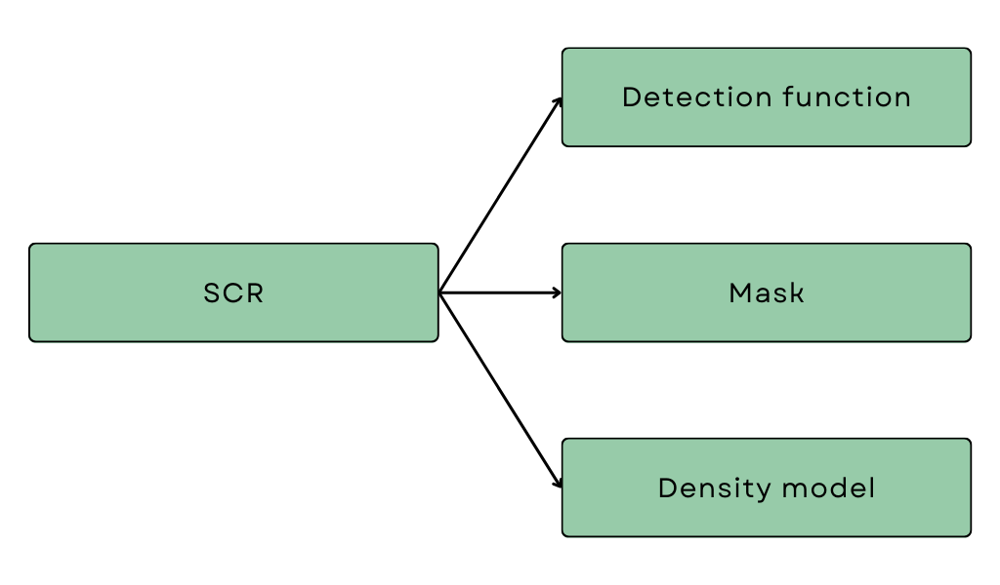

```{r setup3, include=FALSE}
# NB if you want to run the Chapter on its own, remove the number after setup in the chunk name and uncomment the code below 

knitr::opts_chunk$set(warning = FALSE, message = FALSE)

#source("RScripts/SCR_Setup.R")

```

## 3 Introduction to SCR {#ch3}

In the previous section, we saw that detection probability varies due to the spatial relationship (i.e. distance) between animals and detectors (here, the recording devices). Traditional mark-recapture analyses overlook this spatial component by assuming a constant probability of detection regardless of the distance between the animal and detector. This leads to inaccurate results, which may have serious consequences. So, some really cool statistical ecologists developed a solution in the form of [spatially explicit capture-recapture]{style="color:#668BA4;font-weight:bold;"} (SECR or SCR). Sounds very fancy but don't worry, it's relatively straightforward, and we won't go into much (if any) statistical detail.

### Survey structure

Before looking at the model structure, it is important that we understand the general structure of SCR data collection. SCR surveys consist of [sessions]{style="color:#668BA4;font-weight:bold;"} and [occasions]{style="color:#668BA4;font-weight:bold;"}.

A session refers to a discrete period of time during which specific spatial capture-recapture surveys or parts of surveys are conducted. It encompasses the entire process of deploying detectors at specific spatial locations for a certain duration, detecting/capturing, potentially marking and redetecting/recapturing animals. Different sessions could refer to repeat surveys of the same area or other areas within a larger survey region. The important thing is that no redetections of the same individuals are possible between sessions and if possible, they are not recorded. Otherwise, the sessions are indistinguishable, and occasions are shared between sessions.

An occasion refers to a distinct event or time point within a session when data are collected, i.e. when an individual is detected and/or redetected. Historically, two survey occasions were necessary to capture and mark individuals and then a second occasion to possibly recapture marked and/or unmarked individuals. This is because animals are physically detained by the detectors used, like pitfall traps or cages. So multiple occasions are necessary to have recaptures. In acoustic SCR surveys, redetections of calls can occur between detectors, so it is not necessary to have at least two occasions; a minimum of one is required. In other words, detectors that do not physically hold animals only require a single survey occasion as they typically allow simultaneous detections and redetections.

In the frog example of Chapter 1, every time you clicked the survey button on the same set of frogs,  you were conducting an occasion within a single session. If you sampled a new set of frogs, a new session started with new occasions! Now, we are ready to look at the SCR model structure.

### SCR components

Spatial capture-recapture models consist of three key components, two sub-models (one for detection probability and one for density) and a mask defining our survey region:

```{r,echo=FALSE,out.width="50%", fig.align='center'}

```

The primary purpose of a SCR model is to estimate parameters, specifically [density]{style="color:#668BA4;font-weight:bold;"} (the number of animals per unit area), of our wildlife population. Mathematically, density is defined as the intensity of a [spatial point pattern]{style="color:#668BA4;font-weight:bold;"}. Let's explain these concepts with a simple example. Imagine standing in a field and tossing a handful of marbles onto the ground. The way those marbles land and spread out across the field creates a pattern. This arrangement of marbles on the ground is a spatial point pattern where the points are the marbles. It's all about how things are distributed and spaced out in a certain area, like a snapshot of where things are located in space.

Now, think about how crowded the field is with marbles. The intensity of the spatial point pattern refers to how many marbles, on average, you would expect to find in a given area of the field. So, if many marbles are close together, the intensity would be high, indicating a dense pattern. On the other hand, if the marbles are more spread out, the intensity would be lower, indicating a more sparse pattern. Intensity helps us understand the overall "busyness" or concentration of points in the spatial pattern. In this context, the points are the locations of the animals, and the intensity of the point pattern is the density of animals.

When we conduct a survey, we collect a sample of the animals and which animals we detect is dependent on the distance between detectors and animals. So to estimate density from our sample, we have to account for the detection process.

### Detection function

The first component, the [detection function]{style="color:#668BA4;font-weight:bold;"}, describes this relationship between detection probability and distance. If we were to plot the shape of the detection function of the basic MR model we looked at in the previous Chapter, it would look like this:

```{r flatcurve,echo=FALSE,fig.align='center'}
ggplot(const_p_dat, aes(x = x, y = y)) +
  geom_line() +
  labs(
    x = "\nDistance (m)",
    y = "Probability of detection\n"
  ) +
  xlim(0, 100) +
  theme_minimal() +
  theme(
    axis.text = element_text(size = 10),
    axis.title = element_text(size = 10),
  )
```

It is simply a straight line at whatever we estimated our probability of detection to be (here 0.25). But the histogram of distances we built reveals a more realistic shape of a typical detection function. The shape below is called the half-normal detection function and is often used in SCR models. The function has two parameters, $g_0$ and $\sigma$, which control certain features of the curve.

```{r detfunc,fig.align='center',echo=FALSE}
ggplot(hn_detfunc_dat, aes(x = dist, y = probs)) +
  geom_line() +
  geom_segment(aes(x = 0, y = 0.5, xend = 23.5, yend = 0.5),
    arrow = arrow(length = unit(0.2, "cm"), ends = "both"), colour = "#476173"
  ) +
  geom_segment(aes(x = 0, y = 1, xend = 23.5, yend = 1),
    arrow = arrow(length = unit(0.2, "cm")), colour = "#5b7a65"
  ) +
  annotate("text", x = 12.5, y = 0.55, label = expression(paste(sigma)), size = 5, fontface = "bold") +
  annotate("text", x = 27, y = 1, label = expression(paste(g[0])), size = 5, fontface = "bold") +
  labs(
    x = "\nDistance (m)",
    y = "Probability of detection\n"
  ) +
  xlim(0, 100) +
  theme_minimal() +
  theme(
    axis.text = element_text(size = 10),
    axis.title = element_text(size = 10),
  )
```

<br/> The first parameter, $g_0$, specifies the probability of detection when the distance between the animal and the detector is zero. The second parameter modifies the width of the shoulder of the curve. It controls how quickly we drop off to zero probability of detection. Play around with the values of the parameters below to see how they affect the shape of the relationship.

```{r, echo=FALSE}
chooseSliderSkin("Flat", color = "#ED5565")
sidebarLayout(
  sidebarPanel(
    selectInput("detFunc", "Select Function:",
      choices = c("Halfnormal", "Hazard Rate", "Exponential", "Uniform", "Hazard Halfnormal")
    ),
    sliderInput("g0", "Set value of g0:", min = 0, max = 1, value = 1),
    sliderInput("sigma", "Set value for σ", min = 0, max = 20, value = 5),
    conditionalPanel(
      condition = "input.detFunc == 'Hazard Rate'",
      sliderInput("z", "Set value for z", min = 0, max = 1, value = 0.5)
    )
  ),
  mainPanel(
    plotlyOutput("detFuncPlot")
  )
)

```

```{r, context="server",echo=FALSE}
# Shiny Server
  observeEvent(input$detFunc == detfunctions[5], {
    updateSliderInput(
      session = session,
      inputId = "g0",
      label = "Set value for λ0",
      max = 5
    )
  }, ignoreInit = TRUE)
  
  output$detFuncPlot <- renderPlotly({
    if (input$detFunc == detfunctions[1]) {
      y <- halfnormal(dist_seq, input$g0, input$sigma)
    } else if (input$detFunc == detfunctions[2]) {
      y <- hazard_rate(dist_seq, input$g0, input$sigma, input$z)
    } else if (input$detFunc == detfunctions[3]) {
      y <- exponential(dist_seq, input$g0, input$sigma)
    } else if (input$detFunc == detfunctions[4]) {
      y <- uniform(dist_seq, input$g0, input$sigma)
    } else if (input$detFunc == detfunctions[5]) {
      y <- hazard_halfnormal(dist_seq, input$g0, input$sigma)
    }
    
    # Create data frame
    df <- data.frame(Distance = dist_seq, Probability = y)
    
    # Create data frame
    df <- data.frame(Distance = dist_seq, Probd = y)
    df$Probability <- round(df$Probd,2) # just for ggplotly label
    
    # Plot
    ggplotly(
      ggplot(df, aes(Distance, Probd, label = Probability)) +
        geom_line(linewidth = 0.7, colour = "#97CBA9") +
        labs(title = paste(input$detFunc, "Detection Function")) +
        xlab("\nDistance") +
        ylab("Detection probability\n") +
        ylim(0, 1) +
        theme_minimal() +
        theme(
          axis.title = element_text(size = 10),
          plot.title = element_text(size = 15)
        ),
      tooltip = c("Distance","label")
    ) 
    
  })
```

There are many other detection functions as well! If we think the relationship between detection probability and distance looks slightly different, we could specify a different detection function. For example, the hazard rate function includes an additional parameter which has an additional parameter, $z$. You can explore other detection functions by selecting from the dropdown list above.

We no longer assume a constant probability of detection; we now have a mathematical model that describes the probability of detection as a function of the distance between detectors and animal locations. We tell the model what we think the shape of our detection function should look like (i.e. half-normal, hazard rate etc.) and then the model will estimate the parameters of the detection function based on the data we collected. You might be thinking, how do I choose the correct detection function? Well, statisticians have shown that, for the most part, it doesn't really matter which shape you choose! As long as the shape is reasonable and aligns with what you know about your detectors and target species.

### Mask

In the frog example of Chapter 1, we conducted an acoustic survey within a habitat patch with hard boundaries, so our survey region was clearly defined. In practice, habitats are typically more continuous and not so well demarcated. We somehow need to define the area we are sampling from and over which we are estimating density. Let's think about what we know.

We know that detection probability tapers off gradually with distance, but we don't know the locations of all the animals we did or did not detect, so we can't define an exact region. We can however define a distance beyond which we are super confident we definitely won't detect a call. This distance is called the [buffer distance]{style="color:#668BA4;font-weight:bold;"} and with the buffer distance, we are ensuring that our probability of detection definitely reaches zero within our sampled area. We can then be confident that we aren't excluding any of the animals we detected in our sample, and our estimate of density is defined over a sensible area.

Okay, but what to do with the fact that we don't know the locations of the animals we did or did not detect? The buffer distance helps us to further deal with this. It creates a polygon around our detectors, and within this polygon, our model will try to estimate probable locations of the detected animals based on our detections and re-detections of the same calls across microphones. To do this, we consider all possible locations where an animal might be within the polygon! This area is a set of points (or rather coordinates) that form a "mask" around our detectors and is collectively referred to as a [habitat mask]{style="color:#668BA4;font-weight:bold;"}. The buffer distance is formally defined as the minimum distance between detector locations and the boundary of the habitat mask.

Play around with the buffer distance below to see how the habitat mask is defined (note the values on the axes as you increase the distance).

```{r ,echo=FALSE}
fluidPage(
  fluidRow(
    sliderInput("buffer",
      "Buffer distance",
      min = 1,
      max = 200,
      value = 100,
      width = "35%"
    ),
    align = "center",
    style = "padding-left:30px;"
  ),
  fluidRow(
    plotOutput("maskBufferPlot"),
    align = "center"
  )
)
```

```{r, context="server",echo=FALSE}
output$maskBufferPlot <- renderPlot({
  mask <- create.mask(traps = trapdf, buffer = input$buffer)

  masks_df <- rbind(mask[, 1:2], trapdf)
  masks_df$type <- rep(c("Mask Point", "Detector"), c(nrow(mask), nrow(trapdf)))


  ggplot() +
    geom_point(data = masks_df, aes(x = x, y = y), alpha = 0.75, colour = "#678BA4") +
    geom_image(data = trapdf, aes(x = x, y = y, image = micro_image), size = 0.2) +
    theme_minimal() +
    coord_fixed() +
    labs(
      x = "\nX",
      y = "Y"
    ) +
    theme(
      legend.position = "bottom",
      legend.title = element_blank(),
      panel.background = element_rect(fill = "#c1e0cb")
    )
})
```

<br/>

The mask can also be modified to more accurately represent the sampled landscape. By incorporating knowledge about specific habitat types or areas unsuitable for the target species, we can refine the mask and exclude regions unlikely to harbour the species of interest. This leads to more accurate density estimates, focusing the analysis on the more relevant and suitable areas for the species.

### Density model

The third component models how the animals are distributed throughout space. Here we describe how we think the marbles we threw on the field are spread out - we make assumptions about what the pattern looks like.

The most basic density model consists of only one parameter, density itself, and assumes that animals are spread evenly across space. In other words, the density of locations is constant throughout our survey region; there is no rhyme or reason to their distribution. Although mostly biologically unrealistic as landscapes are complex and consist of different habitats and features, assuming constant density may, in some cases, still provide reliable estimates of average density. For example, assuming constant density over small areas is not unreasonable. 

```{r ,echo=FALSE}
fluidPage(
  fluidRow(
    sliderInput("density",
      "Density (number of locations per hectare)",
      value = 25,
      min = 0,
      max = 200,
      width = "35%"
    ),
    align = "center",
    style = "padding-left:26px;"
  ),
  fluidRow(
    plotOutput("constantDensityPlot"),
    align = "center"
  )
)
```

```{r, context="server",echo=FALSE}
output$constantDensityPlot <- renderPlot({
  set.seed(1908) # set seed
  temppop <- sim.popn(D = input$density, expand.grid(x = c(0, 100), y = c(0, 100)), buffer = 50)

  ggplot(temppop, aes(x = x, y = y)) +
    geom_point() +
    labs(
      x = "\nX",
      y = "Y\n"
    ) +
    coord_fixed() +
    theme(
      legend.position = "top",
      legend.title = element_blank(),
      panel.background = element_rect(fill = "#c1e0cb"),
      panel.grid.minor = element_blank(),
      panel.grid.major = element_blank()
    ) +
    scale_x_continuous(n.breaks = 15) +
    scale_y_continuous(n.breaks = 10)
})
```

Alternatively, we can specify a model that describes density as varying unequally across space. Animal locations could vary due to, for example, the spatial arrangement of suitable habitats such as vegetation type or leaf litter or a spatial trend across the landscape. In the latter case, we could specify a linear trend or even a quadratic trend in density by modelling density as a function of the x and y coordinates of the specified mask. Have a look at the first two graphs below. We're not going to worry too much about the units per now, we're only demonstarting the idea. 

Landscape features can be anything we think is an essential determinant of where our target species might be, including the distance to or level of noise from human settlements or activities. We can then model density as a function of such variables, allowing density to change throughout the survey region accordingly. These features we call habitat covariates, and for every mask point, we have to have a value for the chosen habitat covariate. There are different ways of obtaining data for every mask point, we could have measured at every point, but this is likely unrealistic for very fine and large habitat masks. Alternatively, given a few measured points across the survey region, we could predict the rest using another statistical model (more on this in later Chapters).

Habitat covariates, such as the forest volume covariate below, can be categorical, consisting of low, median and high levels. In that case, we have three model parameters related to three density estimates, one for each level of forest volume. The graph shows the regions of high, median and low and the table has the corresponding estimate of density. 

They can also be continuous, such as noise from anthropogenic activities measured in decibels. Then we get a continuous density surface with a predicted density value for every mask point. Under this model, we have two parameters, a baseline density when noise is at zero and a parameter describing the effect of noise on density. We use the effect parameter to predict the surface you see below. It's clear that for regions with high levels of noise, we have low density and vice versa. 

```{r ,echo=FALSE}
fluidPage(
  # use shiny feedback
  tabsetPanel(
    tabPanel("Linear trend",
      fluid = TRUE,
      plotOutput("linearPlot")
    ),
    tabPanel("Quadratic trend",
      fluid = TRUE,
      plotOutput("quadPlot")
    ),
    tabPanel("Forest cover",
      fluid = TRUE,
      fluidRow(
        column(6,  plotOutput("forestVolPlot")),
        column(6,  dataTableOutput("forestDT"),style="align: center;")
      )
    ),
    tabPanel("Noise",
      fluid = TRUE,
      fluidRow(
        column(6, plotOutput("noisePlot")),
        column(6, plotOutput("noiseDensityPlot"))
      )
    )
  )
)
```

```{r, context="server",echo=FALSE}
output$linearPlot <- renderPlot({
  ggplot(linear_mod$pred_data) +
    aes(x = X, y = Y, z = Density, fill = Density) +
    geom_tile() +
    geom_contour(color = "grey", alpha = 0.5) +
    geom_text_contour(aes(z = Density), stroke = 0.1, colour = "grey") +
    coord_equal() +
    scale_fill_viridis() +
    theme_bw()
})

output$quadPlot <- renderPlot({
  ggplot(quad_mod$pred_data) +
    aes(x = X, y = Y, z = Density, fill = Density) +
    geom_tile() +
    geom_contour(color = "grey", alpha = 0.5) +
    geom_text_contour(aes(z = Density), stroke = 0.1, colour = "grey") +
    coord_equal() +
    scale_fill_viridis() +
    theme_bw()
})


output$noisePlot <- renderPlot({
  # noise covariate data
  noise_data <- noise_mod$model_fit$all.covariates
  colnames(noise_data)[3] <- "Noise"

  ggplot(noise_data) +
    aes(x = x, y = y, z = Noise, fill = Noise) +
    geom_tile() +
    geom_contour(color = "grey", alpha = 0.5) +
    geom_text_contour(aes(z = Noise), stroke = 0.1, colour = "grey") +
    coord_equal() +
    ggtitle("Level of noise from human activities") +
    scale_fill_distiller(palette = "Spectral") +
    theme_bw()
})

output$noiseDensityPlot <- renderPlot({
  ggplot(noise_mod$pred_data) +
    aes(x = X, y = Y, z = Density, fill = Density) +
    geom_tile() +
    geom_contour(color = "grey", alpha = 0.5) +
    geom_text_contour(aes(z = Density), stroke = 0.1, colour = "grey") +
    coord_equal() +
    ggtitle("Predicted density surface (D=~noise)") +
    scale_fill_viridis() +
    theme_bw()
})

output$forestVolPlot <- renderPlot({
forest_vol_data <- forest_mod$pred_data %>%
  mutate(Forest = ifelse(
    Density == "2015", "Low",
    ifelse(Density == "4363", "High","Median")
  ))

ggplot(forest_vol_data) +
  aes(x = X, y = Y, fill = Forest) +
  geom_tile() +
  coord_equal() +
  scale_fill_manual(values=c("#B2182B","#FEE08B","#3288BD")) +
  theme_bw()

})

output$forestDT <- DT::renderDT({
  forest_vol_data %>%
    select(Forest,Density) %>%
    distinct(Density,Forest) %>% 
    arrange(desc(Density)) %>%
    DT::datatable(
      class = "cell-border",
      escape = FALSE,
      extensions = "Buttons",
      selection = "single",
      options = list(dom = "t", ordering = F)
    )
})

output$forestPlot <- renderPlot({
ggplot(forest_mod$pred_data) +
  aes(x = X, y = Y,fill = Density) +
  geom_tile() +
  scale_fill_manual(values = c("#450D54","#56C666","#FDE823"))+
  coord_equal() +
  theme_bw()
})
```

In later Chapters, we'll look into these parameters' interpretation in more detail. For now, you must understand that we can include habitat covariates in our model to allow density to vary across the survey region.

Before moving on, let's ensure we understand some core concepts with a quick quiz. You can try the questions multiple times; some may have more than one correct answer.

```{r quiz1, echo=FALSE}
quiz(
  caption = "Quick quiz",
  question("How many parameters does a SCR model with constant density and a half-normal detection function have?",
    answer("1 (Density)", message = "Almost, but what about the detection function?"),
    answer("3 (g0,σ and density)", correct = TRUE, message = "Woohoo! That's correct :) "),
    answer("2 (probability of detection and density)", message = "Not quite, remember probability of detection is now a function of distance."),
    answer("4 (g0, σ, habitat mask and density)", message = "Close, but remember we have to specify the habitat mask so that our model can estimate density."),
    allow_retry = TRUE,
    random_answer_order = TRUE
  ),
  question("What is the primary purpose of SCR models?",
    answer("To estimate animal density", correct = TRUE),
    answer("To estimate the probability of detection"),
    answer("To identify individual animals from CR data"),
    answer("To study animal movement and behaviour"),
    incorrect = "Try again!",
    allow_retry = TRUE,
    random_answer_order = TRUE
  ),
  question("What is the relationship between the buffer distance and the habitat mask?",
    answer("The mask includes regions beyond the buffer distance."),
    answer("The buffer distance is a parameter within the mask."),
    answer("The buffer distance defines the mask area, it is the minimum distance between a detector and the mask boundary.", correct = TRUE),
    answer("The mask defines the length of the buffer distance specified."),
    incorrect = "Incorrect, if you're unsure why not play around with the buffer distance again.",
    allow_retry = TRUE,
    random_answer_order = TRUE
  ),
  question("Which term is used to describe the assumption of animals being evenly distributed across space?",
    answer("Spatial point pattern"),
    answer("Variable intensity"),
    answer("Constant density", correct = TRUE),
    answer("Inhomogenous density"),
    incorrect = "Nope!",
    allow_retry = TRUE,
    random_answer_order = TRUE
  ),
  question("What component of an SCR model describes how animals are distributed throughout space?",
    answer("Habitat mask"),
    answer("Detection function"),
    answer("Density model", correct = TRUE),
    answer("Buffer distance"),
    incorrect = "Think about the marble example!",
    allow_retry = TRUE,
    random_answer_order = TRUE
  ),
  question("In the context of SCR modeling, what does the 'mask' refer to?",
    answer("A tool for capturing animals using detectors."),
    answer("A set of coordinates defining a habitat where animals occur."),
    answer("A set of points or coordinates that define the area within which we are detecting animals.", correct = TRUE),
    answer("The mask is a set of coordinates which defines our survey region over which we estimate density. ", correct = TRUE),
    incorrect = "Not quite!",
    allow_retry = TRUE,
    random_answer_order = TRUE
  ),
  question("What is the main advantage of using a spatially explicit capture-recapture model?",
    answer("It simplifies the analysis process."),
    answer("It eliminates the need for habitat covariates."),
    answer("It focuses only on animal density estimation."),
    answer("It accounts for spatial variation in detection probability.", correct = TRUE),
    incorrect = "Not quite!",
    allow_retry = TRUE,
    random_answer_order = TRUE
  ),
  question("Which parameter of the detection function specifies the probability of detection when distance is zero?",
    answer(sprintf("$g0$"), correct = TRUE),
    answer(sprintf("$z0$")),
    answer(sprintf("$\\sigma$")),
    answer(sprintf("$z$")),
    incorrect = "Not quite!",
    allow_retry = TRUE,
    random_answer_order = TRUE
  ),
  question("Why can't we assume constant probability of detection throughout the survey region?",
    answer("Animals closer to detectors are more likely to get detected than those further away.", correct = TRUE),
    answer("It is realistic, detectors can record animal calls equally regardless of where the animal are located."),
    answer("Besides distance, other factors may also influence an animals' probability of detection such as the volume of it's call.", correct = TRUE),
    answer("Animals are evenly spread out, so distance doesn't matter. "),
    incorrect = "Not quite!",
    allow_retry = TRUE,
    random_answer_order = TRUE
  ),
  question("What does the buffer distance ensure regarding detection probability?",
    answer("It ensures 100% detection within the buffer."),
    answer("It prevents animals from being detected."),
    answer("It provides a confidence interval for detection."),
    answer(" It ensures detection probability reaches zero within the sampled area.", correct = TRUE),
    incorrect = "Not quite!",
    allow_retry = TRUE,
    random_answer_order = TRUE
  )
)
```

::: learnBox
**Summary:**

-   To combat the issues of traditional mark-recapture models, statistical ecologists developed spatial capture-recapture (SCR).
-   SCR models have three key components: detection function, mask and density model.
-   The detection function describes the relationship between detection probability and distance.
-   The mask defines the area of our study and is a set of coordinates that form a "mask" around the detectors.
-   The buffer distance is the minimum distance between a detector and the edge of the mask.
-   We describe the distribution of animals through a density model.
-   Density can be either constant throughout the survey region or it can be modelled as a function of habitat covariates and spatial trends.
-   SCR models combine sub-models for detection probability and density together with a habitat mask and in doing so they estimate density within a defined survey region while accounting for the spatial variation in detection probability.
:::
