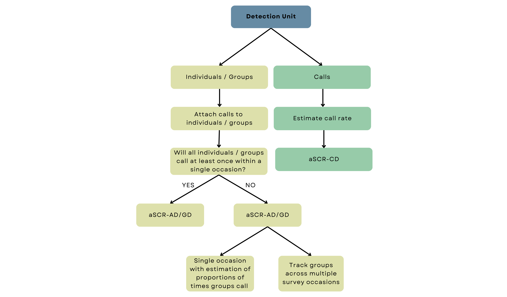

## Overview of aSCR

So far, we have investigated distance-dependent detection and briefly looked over the structure of an SCR model in the context of acoustic sampling. When we use an SCR model for acoustic surveys, we refer to it as acoustic spatial capture-recapture or aSCR for short. 

There is an important distinction to make before we can move on to acoustic data analysis. In the frog example of Chapter 1, we assumed each frog made one call so we could equate a detected call with one individual frog. Rarely does an individual, let alone all individuals in a population, call only once during a survey, and it's not always possible to match calls to individuals. In other words, we can't typically classify multiple detected calls as belonging to one individual. In that case, our density model describes the distribution of <span style="color:#668BA4;font-weight:bold;">call locations</span> and not <span style="color:#668BA4;font-weight:bold;">animal locations</span> as we've described previously. Call locations are simply the location from which a call was made. The aSCR model implemented and the interpretation of the density estimate is different depending on which type of location we are modelling, and that is determined by the <span style="color:#668BA4;font-weight:bold;">detection unit</span> of our study. 

The detection unit is simply the thing we record as having been detected. The detection unit is a call if we only record calls and not the animal the call belongs to. If we detect some calls from identified animals, the detection unit is the animals. Animals may further be distinguished as individuals or groups of animals, so we could detect calls coming from individuals or groups of animals. 

```{r,echo=FALSE,out.width="100%", fig.align='center'} 
knitr::include_graphics("images/detflow1.png")
```

The raw data that any acoustic survey collects are audio recordings of the calls produced by the wildlife population. The recordings are then typically processed via a computer program to isolate the calls of the target species. For example, there is an open-source software program called <a href="http://www.pamguard.org/" target="_blank">PAMGAURD</a> that can be used to identify calls of certain species. This cool technology was first made for studying marine mammal sounds, but it has also been used in many studies to identify the calls of the Cape Moss frog's croaks. Automated sound identification procedures, including complex machine learning algorithms and statistical models, are complicated and varied. These are not the focus of this tutorial, but if you'd like to know more about detecting and classifying acoustic signals or just the use of passive acoustics in ecological monitoring, <a href="https://besjournals.onlinelibrary.wiley.com/doi/full/10.1111/2041-210X.13101" target="_blank">this</a> is a cool paper to read. 

The recording devices used in acoustic surveys typically also record other information with audio recordings, called metadata. Two common types of extra information are the strength of the received acoustic signal (i.e. the call) and the time that the call was detected, referred to as <span style="color:#668BA4;font-weight:bold;">signal strength</span> and <span style="color:#668BA4;font-weight:bold;">time of arrival</span> data, respectively. So each isolated call may have an associated signal strength and/or arrival time attached to it. We can include these measurements in our analysis to help our model estimate the likely locations of detected calls and, consequently, improve density estimates. We'll explore this further in the next chapter. 

### Calling Density 

At this point, the data can be analysed on the call level (i.e. with a call as the detection unit) with an aSCR model that models call locations. Consequently, our density estimate is <span style="color:#668BA4;font-weight:bold;">calling density</span> - the number of calls per unit area per unit time. We call this model aSCR-CD for short, where CD stands for calling density. 

If we want to convert calling density to animal density, we have to know the average call rate of our target species. We could use the average call rate from previous studies or independently collect data to estimate the call rate ourselves. 

```{r,echo=FALSE,out.width="100%", fig.align='center'} 
knitr::include_graphics("images/detflow2.png")
```

### Animal (or Group) Density 

Identities of animals are never directly observed in acoustic surveys - but if we can match detected calls to individual animals or groups of animals, we can model animal or group locations and consequently, estimate <span style="color:#668BA4;font-weight:bold;">animal or group density</span> directly. Hence the model name, ascr-AD/GD. Our detection unit is then an animal or a group of animals, depending on the nature of the target species. 

If you're confused about the difference between call and animal locations, this will help: in the aSCR-CD model, we assume that animals move around between calls, so each call has a unique location. Under the aSCR-AD/GD model, we assume that the detection units do not move between calls which is another way of saying calls from one animal or group come from the same location.  

Data pre-processing starts as in aSCR-CD; we have to isolate the species' calls from the raw data. However, we have to somehow classify calls as belonging to specific individuals or groups. 

```{r,echo=FALSE,out.width="100%", fig.align='center'} 
knitr::include_graphics("images/detflow3.png")
```

This particular aSCR model was developed relatively recently (in 2021), and presently, procedures to distinguish individual animals or groups from acoustic data remain unattainable for most taxa. Even in cases where it is feasible, accomplishing this task demands a lot of hands-on work and may have considerable uncertainty attached to individual identities. Similar to call identification, automated procedures using machine learning techniques are likely to emerge in the near future, and when they do, the aSCR-AD/GD model will be the way to go for density estimation (unless calling density is of specific interest).  

Under the ASCR_AD/GD and ASCR-CD model, we assume that all individuals or groups called at least once during the survey and either detect those calls or not. Typically, there is no reason to think otherwise, and we can implement a straightforward aSCR survey and the aSCR-AD/GD model as is to estimate animal or group density. 

```{r,echo=FALSE,out.width="100%", fig.align='center'} 
knitr::include_graphics("images/detflow4.png")
```

### Animal (or Group) Density with additional data collection

If, however, there are clear reasons why some would definitely not have called even once during our survey occasion, we have to either estimate an additional parameter (similar to the idea of estimating the call rate in aSCR-CD) or adjust our survey structure. 

For example, gibbons (Family Hylobatidae) occur in groups that engage in duetted singing; not all groups will sing daily. The singing frequency between and within groups may also differ due to weather-related changes. Typically, a survey occasion is conducted for two hours in the morning, so this assumption is violated because we know not all groups sing in a single day. You might be thinking that why could we not increase our survey length? Well, it is likely impossible to increase it to such an extent that the assumption holds. In this case, making the survey length a whole day would not solve the problem, likely even two or three days either and then we could also likely be violating the assumption of a closed population. 

For species like this, we have to do a little bit more. We could either stick with a single aSCR survey and then have to estimate independently the proportion of times individuals or groups call. This requires that human surveyors conduct focal follows of detected groups or individuals over additional occasions to estimate the average proportion of times the units vocalise. Alternatively, we can conduct aSCR surveys on multiple occasions, which requires that individuals or groups can be linked across occasions and that enough occasions are chosen to ensure that each individual or group within the survey region is likely to have called at least once. In Chapter 6, we will look at these methods in more detail. 

```{r,echo=FALSE,out.width="100%", fig.align='center'} 

```

Putting all of that together, we can see the three main workflows of acoustic SCR determined by the type of detection unit and whether or not we ... 

The upcoming chapters will cover these analyses. We'll introduce the R package we will use and implement a simple aSCR model for call locations (aSCR-CD). Then we will look at ASCR-CD when additional information is included in the analysis. Next, we'll look into implementing the acoustic SCR model (aSCR-AD/GD) when we have scaled our data to the animal or group level and can directly estimate animal or group density (AD/GD). Lastly, we look at the aSCR-AD/GD model when we cannot assume that all individuals or groups will call during a single survey. 

::: learnBox
**Summary:** 

- Spatial capture-recapture models for acoustic data are known as acoustic spatial capture-recapture or aSCR for short. 

- The detection unit of the survey determines the type of aSCR model used and, thus, the type of density estimated. 

- When the detection unit is a call, we model call locations and estimate calling density (aSCR-CD).

- We model animal locations and estimate animal density (aSCR-AD) when the detection unit is an animal.

- When the detection unit is a group of animals, we model group locations and estimate group density (aSCR-CD).

- Regardless of the detection unit, the ultimate density estimate is the density of calling animals or groups. 

- Recording devices can record additional information, such as signal strength and time of arrival associated with the recorded calls. 

- Under the aSCR-AD/GD model, we assume that all individuals or groups will call during a single survey; if not we have to adjust our survey structure accordingly. 

:::


