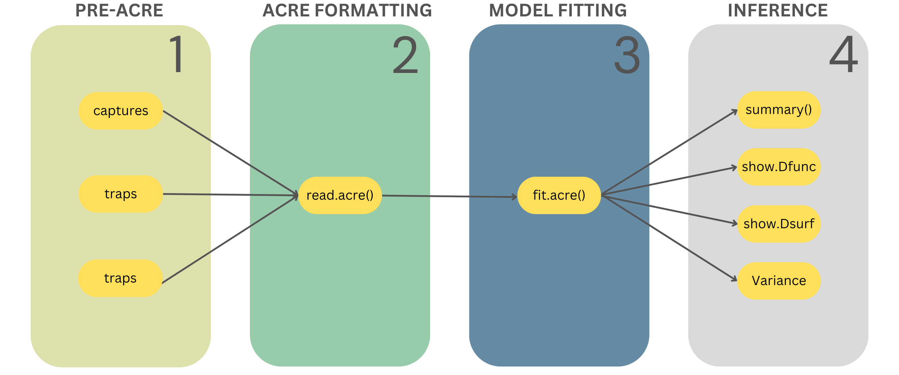

```{r setup5, include=FALSE}
# NB if you want to run the chapter on its own, remove the number after setup in the chunk name

# source("RScripts/Chapter5_Setup.R")

```

## ASCR-CD

We'll be working with real acoustic data collected a few years back on a population of Cape Moss frogs. This data was gathered by Stevenson et al. (2015), who also authored the paper that details the specific aSCR-CD model we'll be using. In their survey, they positioned six microphones in a somewhat circular arrangement within the frogs' habitat. We are using the same 25 second subset of the recording as in the paper which was processed using the program PAMGUARD to identify calls of the frog.

For those curious to visualize the setup, you can check out the arrangement by following this link <a href="https://www.youtube.com/watch?v=JTYFYtZJXro&t=56s" target="_blank">here</a>. The video not only showcases the microphone configuration but also offers a glimpse into the aSCR method. As you watch, you'll be treated to audio recordings of the Cape Moss frogs, along with a probable region from which each call likely originated as estimated by an aSCR model. 

### Introduction to $\texttt{acre}$

We're using a relatively new and slightly unfinished package called $\texttt{acre}$ (named after the method but also an acre is a unit of measurement). This package is essentially a modernized and improved version of the initial aSCR R package, named $\texttt{ascr}$. The $\texttt{acre}$ carries forward the essentials of the previous one but also introduces the animal density model and a range of other capabilities.

For those who have explored other SCR R packages, you'll find the structure of the $\texttt{acre}$ package is familiar.  Analysis using the $\texttt{acre}$ package occurs in four distinct phases: First, there's the Pre-$\texttt{acre}$ stage, where we prepare our data. Then, we move to the process of $\texttt{acre}$ formatting, combining our data for further analysis. Following that, we get into the meat of things — model fitting. In the last phase, inference, where we draw meaningful conclusions from our fitted model.

So, in a nutshell, our journey through aSCR analysis involves these four key phases: Pre-$\texttt{acre}$, $\texttt{acre}$ Formatting, Model Fitting, and Inference. Each phase plays a critical role in unpacking the insights hidden within our data. 

```{r,echo=FALSE,out.width="100%", out.extra='style=" display: block; margin: 1em auto;"'}

```

### Pre-$\texttt{acre}$

The first phase requires modifying the data you have collected so that it is in the required format for use in the $\texttt{acre}$ package and creating a mask object. Let's go through each of these.

#### Captures

The captures dataframe contains our detections. The dataframe must have at least 4 columns, where the first column is called "session", the second "ID", third, "occasion" and the fourth column is "trap". Each row of the dataframe is considered a detection, meaning that each row is a recorded call at a microphone. Our data is already in this format, let's have a look at it.

```{r captures, exercise=TRUE,exercise.eval=FALSE}
head(captures) # shows first six detections
```

```{r captures-hint}
tail(captures) # last six detections
summary(captures) # summary of dataframe
length(unique(captures$ID)) # number of unique calls detected
```

You can play around with the dataframe if you want, use functions like tail() to look at the last few detections or try to find out the number of calls detected (see the hint for code).

The "ID" column contains unique identification numbers for all the calls that were detected and the column "trap" contains the number of the detector at which the call was recorded. For example, one call with ID "1" was only detected at the second trap. Call "2" was detected at traps three, four and five. Note that the calls aren't labelled in the order they were recorded, we've just used these labels for simplicity.

Recall from Chapter 3 that one can have multiple survey occasions and that typically, acoustic surveys only need one occasion. If we have multiple survey occasions, the column "occasion" will indicate during which occasion the detection was made. In a similar vein, the "session" column indicates in which session the occasion occurred. We do not deal with multiple sessions or occasions in this chapter, so both columns consists entirely of 1s.

Depending on what your raw data looks like, there are several ways to get to the required form. At the end of this Chapter there is an RScript you can download which contains the full analysis we did here and also some data preparation code for conversion from binary detection histories to the required format.

#### Traps

The second object, traps, can either be a list, matrix or dataframe and in the context of aSCR, traps refer to the recording devices. 

If we had multiple sessions then we would have a list of dataframes or matrices, each containing the Cartesian coordinates of the detector locations. Since we are only working with a single survey occasion, we do not have to worry about the list version of traps right now. For our analysis, the object will be either in matrix or dataframe format. Either way, the object should consists of two columns representing the x and y Cartesian coordinates of our detector locations. Below, we again look at the first six rows and then plot the detector locations.

```{r traps, exercise=TRUE,exercise.eval=FALSE}
head(traps)

# plot trap locations

ggplot(traps, aes(x = x, y = y)) +
  geom_point() +
  coord_fixed() +
  xlim(-5, 10) +
  ylim(-5, 10) 
```

We are using the package ggplot to visualize our data. We supply the dataframe to ggplot() and then we tell it what to plot on the x and y axes within the brackets of $\texttt{aes()}$, here it is simply the names of the columns of the traps dataframe, 'x' and 'y'. Then we specify that we want a scatterplot with $\texttt{geom_point()}$, i.e. we want a plot of points and we specify the limits of the axes with $\texttt{xlim()}$ and $\texttt{ylim()}$. We've changed the x and y limits on the axes so you can see the arrangement clearly. Adding all these things together with a plus sign (note that this notation only works for ggplot code) plots the data.

#### Mask

The third thing we have to supply is the habitat mask. We create a mask with the function $\texttt{create.mask()}$ which requires, at minimum, the traps dataframe and a buffer distance. 

#### Quick diversion on the buffer distance 

SCR theory has shown that the buffer distance isn't super crucial as long as it is sufficiently wide to ensure that animals located at the periphery have an extremely low probability of being detected. 

A rule of thumb when using a halfnormal detection function is four times its "shoulder parameter", $\sigma_{hn}$. We can get a quick and biased estimate of $\sigma_{hn}$ from our data using the function $\texttt{RPSV()}$ from the $\texttt{secr}$ package and multiply it with four to get a buffer distance. 

An alternative way is using the function $\texttt{suggest.buffer()}$, also from $\texttt{secr}$. This function as its name implies, provides a mere **suggestion** of buffer distance based our detection data and traps. The methodology behind the function is not well documented and we're not going to try and explain it here, but we can use this function to get a suitable buffer distance and then check after model fitting whether the distance was wide enough.

To do either of the two methods, we have to convert our data to the $\texttt{secr}$ format. First we add a column to the traps dataframe called "trap" that contains the trap identification number. Then we create a $\texttt{secr}$ traps object with the function $\texttt{read.traps()}$ where we supply the traps dataframe, tell the function which column contains the trap identification numbers and also what type of detectors were used. Recall from Chapter 3 that recording devices and any other detector that does not physically detain animals, are proximity detectors. 

Then we create a $\texttt{secr}$ capture history object with the captures dataframe, the $\texttt{secr}$ traps object and we specify the format we have used for the captures dataframe. The options are "trapID" and "XY", where the first option indicates that the last column in the captures dataframe contains the trap identification number where each detection was made (like we have - session, ID, occasion, traps). The other format is if we have the x nd y coordinates of the trap location instead of the number (session, ID, occasion, x, y). 

```{r buffer, exercise=TRUE,exercise.eval=FALSE}
# trap dataframe
traps$trap <- rownames(traps) # add trap column with trap ids

secr_traps <- read.traps(
  data = traps, # trap layout data
  trapID = "trap", # name of ID column
  detector = "proximity"
) # detector type

secr_capthist <- make.capthist(
  captures = captures, # captures
  traps = secr_traps, # traps
  fmt = "trapID"
) # format of captures

# quick and biased sigma
initialsigma <- RPSV(
  capthist = secr_capthist,
  CC = TRUE
)

round(4 * initialsigma) # suggested buffer distance

# using suggest.buffer()

suggest.buffer(object = secr_capthist, detectfn = "HN")
```

Back to the mask! Below we've created a simple mask with specified the suggested buffer distance of 14 metres. We visualize the mask and detectors together with ggplot. Inspect the mask object further, is it a dataframe or a matrix?

```{r mask, exercise=TRUE,exercise.eval=FALSE}
# create mask
mask <- create.mask(lightfooti_traps, buffer = 10)

# inspect mask object
head(mask)

ggplot() +
  geom_point(data = as.data.frame(mask), aes(x = x, y = y, color = "Mask"), alpha = 0.2) +
  geom_point(data = traps, aes(x = x, y = y, color = "Detector")) +
  scale_color_manual(values = c("Mask" = "darkgrey", "Detector" = "blue")) +
  labs(title = "Habitat mask & microphones", x = "X", y = "Y") +
  theme(legend.title = element_blank())
```

```{r mask-hint}
# inspect object
class(mask)
str(mask)

# help files
?create.mask()
?make.mask()
```

We can also modify our mask by specifying the spacing between mask points with the argument **spacing** and we can exclude certain mask points that represent non-suitable habitat using the **poly** arguments. Have a look at the help file for the function which will point you toward the function $\texttt{make.mask()}$ from the $\texttt{secr}$ package. 

If you've inspected the object, you would have seen that the created mask object is a matrix, we have to convert it to a dataframe if we want to plot it with ggplot. The code is slightly more complicated than the previous plot, we've colour coded the points using the arguments **color** in the aes functions of each geom_point and we've assigned a color to each using the $\texttt{scale_color_manual()}$ function. Lastly, a title is added and the legend title is removed. 

### $\texttt{acre}$ formatting

In the next phase, $\texttt{acre}$ formatting, we supply all the objects from the first phase to a key function of the package called $\texttt{read.acre()}$. This function creates an object of class "acre_data" and essentially links together our detectors and detection data. Any other data objects we need for model fitting is also included here. 

The first three arguments of this function are the three objects we created in the previous phase. If we have any habitat covariates we want to include in our density model, we also supply it here in the argument **loc_cov**. The argument takes a dataframe consisting of at least three columns, the first two are x and y coordinates of where the habitat covariates have been measured and the remaining columns contain the covariate values. For example: 

```{r examp_loc, exercise=TRUE,exercise.eval=FALSE}
example_loc_data <- data.frame(
  x = c(-20, -20, -20, 2.5, 2.5, 2.5, 25, 25, 25),
  y = c(-20, 5, 30, -20, 5, 30, -20, 5, 30),
  noise = c(6, 10, 11, 7, 12, 10, 11, 9, 8),
  forest_vol = c("high", "high", "median", "median", "median", "low", "low", "low", "low")
)

head(example_loc_data)
```

Remember we mentioned in Chapter 3 that we typically don't have covariate values for every mask point and that given a few measured locations (like in the dataframe above), we can impute the rest. This will happen in the model fitting phase, the habitat covariates will be scaled to the mask level, i.e. every mask point will have an associated covariate value (more on this below). 

However, if we don't have any habitat covariates but we do want to model density with a spatial trend (i.e. as a function of the x and/or y coordinates of our mask points) we have to do the following. You can include a random subset of x and y coordinates pairs (like the example above) or all the mask points, but because the function expects a dataframe with more than two columns, we add a random column that won't be used. 

Below we create a dataframe called "cov_data" that contains the coordinates of all the mask points and a random column called spat_trend where every entry is just "yes". It really doesn't matter what this column is, we just need a third column. We then supply the dataframe together with the captures, traps and mask object to the $\texttt{read.acre()}$ function. 

```{r cov_dat, exercise=TRUE,exercise.eval=FALSE}
cov_dat <- data.frame(x = mask[, 1], y = mask[, 2], spat_trend = "yes")

lightfooti_data <- read.acre(
  captures = captures,
  traps = traps,
  mask = mask,
  loc_cov = cov_dat
)

# alternative mask creation

# lightfooti_data <- read.acre(
#   captures = captures,
#   traps = traps,
#   control_create_mask = list(buffer=10),
#   loc_cov = cov_dat
# )
```

The commented lines of code show the second way in which we could have created the mask. Instead of using the argument mask, we supply the arguments of the $\texttt{create.mask()}$ function as a list to the argument **control_create_mask**. 

Some other arguments and important points:

-   The default units for the $\texttt{acre}$ package is metres and seconds. If our data are not in metres and seconds, we can specify in the **units_convert_dist** and **units_convert_time** arguments the number needed to convert from whatever our data is in to meters. For example, if our data is in minutes, then we assign the value 60 to the argument **units_convert_time.** Likewise, if our data are in cm for some reason then we assign the value 0.01 to **units_convert_dist**.

-   If we have reason to believe that there are other factors that influence the detection probabilities of individual detectors, we can supply a dataframe containing the trap specific information to the argument **trap_cov.**

-   Similarly, if we had multiple sessions and we have quantified some information about the different session that might influence our model estimates, then we can supply this data to the argument **session_cov**.

-   Typically we don't have covariate data for every point in our habitat mask but rather only a few select points in the survey region. We can use the information we have to impute data for the rest of the mask. The $\texttt{read.acre()}$ function does this for us using a machine learning algorithm called Approximate Near Neighbor. Essentially, this method calculates the likely value of each mask point based on the values of a specified number of nearest points with measured covariate values. We can modify some of the parameters of this method if we want, but this is beyond the scope of this tutorial (have a look at the function help file for more details).

### Model fitting 

Finally, we are ready to fit some aSCR models! We have gone through the first two phases, getting our data objects ready and putting them all together with the $\texttt{read.acre()}$ function. Now, we use the key function, $\texttt{fit.acre()}$, to fit the aSCR model. 

The first argument of the function (**dat**) is the acre_data object we created with the $\texttt{read.acre()}$ function. Then, we tell the model what our density model is with the **par_extend_model** argument. The default is to assume constant density which is specified as "D~1". The notation reads as Density (D) is (=) a function of (~) whatever comes next. The model formulas for the examples we looked in Chapter 3 were specified as follows (plus some other trends):

- East-west trend: D = ~ x 

- North-south trend: D = ~ y 

- Linear trend: D = ~ x + y 

- Quadratic trend: D = ~ x^2 + x*y + y^2 

- Density as a function of noise: D = ~ noise

- Density as a function of noise: D = ~ forest_vol

In the above, x and y, are the mask points and "noise" and "forest_vol" are the habitat covariates which should correspond to the column names used in the dataframe assigned to the **loc_cov** argument of the $\texttt{read.acre()}$ function. 

Then, we tell the function which type of detection function to fit to the data in the **detfn** argument. For example, if we specify the halfnormal detection function, we assign the character string "hn" to argument. There are other arguments which we have not covered here. These are all optional arguments and the ones we have presented are required for model fitting. Let's fit a simple model using the objects we have created so far. 

Below we fit a constant density model and a halfnormal detection function to the frog data and call the model, "model1". We don't have to specify the density model in the **par_extend_model** argument as we are using the default model. The detection function parameter, $g0$, is fixed at one, since we expect that all calls made exactly at the detector locations will be recorded. Straightforward and easy right?

```{r model1, exercise=TRUE,exercise.eval=FALSE}
model1 <- fit.acre(
  dat = lightf_data,
  detfn = "hn",
  fix = list(g0=1)
)
```

### Inference 

Now that we have fitting some models, we can look at the model estimates. Extracting information from our model object is not different from any other model objects you might have used before. We'll begin with model1. We can use the $\texttt{summary()}$ function the look at a summary of our model estimates: 

```{r inf1, exercise=TRUE,exercise.eval=FALSE}
summary(model1)
```

The output tell us the detection function used to fit the model, the number of sessions, whether or not extra information was inputted into the model and the method use for constructing confidence intervals of our estimates. Below that we get a neat table of our model estimates and associate variance estimates. 

For each parameter of our model, we obtain an estimate, a <span style="color:#668BA4;font-weight:bold;">standard error</span>, and two additional values under the columns labeled "2.5%" and "97.5%." These values define a <span style="color:#668BA4;font-weight:bold;">confidence interval</span> for our estimate. While we assume you have some familiarity with these concepts, we offer a brief explanation here. Alternatively, if you need more information, you can refer back to the welcome page where we provide additional resources.

Quantifying the uncertainty of our model estimates is crucial. When conducting a survey, we collect a sample to estimate population-level parameters (e.g., density). However, due to random differences between samples, our estimates will vary from one sample to another. The standard error serves as a measure of the variability or precision of an estimate. It tells us how much the estimated parameter is expected to differ across different samples. Smaller standard errors are preferable, as they indicate less variability and increased precision.

A confidence interval is a range of values calculated from the sample data that surrounds a single estimate. This interval provides a range where the true population parameter is likely to fall under repeated sampling. For instance, a 95% confidence interval for a mean suggests that if you were to repeatedly draw samples from the same population and compute confidence intervals each time, the true population mean would likely be within that interval about 95% of the time. In simpler terms, we can express 95% confidence that the interval contains the true mean. A narrower interval is better, just like a smaller standard error, as it reflects reduced variability and greater precision.

The following bit is really important. In the aSCR-CD model, these values are not reliable. Understanding the underlying statistical and mathematical concepts is necessary to grasp the reason behind this limitation, and we have intentionally avoided delving into these complexities. If you're interested in learning more, we recommend reading the paper by <a href="https://besjournals.onlinelibrary.wiley.com/doi/full/10.1111/2041-210X.12291" target="_blank">Stevenson et al. (2015)</a> for a comprehensive explanation of the model formulation and assumptions. However, for the purposes of this tutorial, what's important to know is that we cannot trust the estimates of standard errors and confidence intervals derived from fitting an aSCR-CD model.

To obtain appropriate standard errors and confidence intervals, we need to use a different function. The $\texttt{boot.acre()}$ function employs a technique called "bootstrapping" to calculate standard errors and confidence intervals of our estimates that can be reliably reported. In this process, we simulate a synthetic population using our model and generate samples (detect calls) from this population using the estimated detection function. We then fit the same model to this simulated data and record the model estimates. This procedure is repeated numerous times, allowing us to compute the standard error and establish confidence intervals as we've essentially done the repeated sampling! Bootstrapping is an extremely useful statistical method, here is a fun video explaining the method further if you want to know more. 

The number of times we perform this procedure (controlled by the argument N) ideally exceeds 100 repetitions, and in practice we would likely opt for more iterations, such as around 1000. This can take super long to run, so we've already done it and saved the output as model1_boot. However, if you're interested, you can carry out this procedure for a smaller N value, say 10. Alternatively, explore the structure of the model1_boot object using the $\texttt{str()}$ function or by typing the object name followed by a dollar sign ($) to examine its contents.

```{r boot, exercise=TRUE,exercise.eval=FALSE}

# boot_N10 <- boot.acre(model1, N = 10)

str(model1_boot)

```

```{r boot-hint}

model1_boot$ 
  
```

There is a lot going on here! Luckily for us, we don't have to delve into all of these. To obtain the standard errors, we simply apply the function, $\texttt{stdEr()}$, to our bootstrap object. To make sure we are using the function from the correct package, we use the following notation $\texttt{acre::stdEr()}$. 

We extract the confidence intervals using the function $\texttt{confint()}$ and specify the argument **type** as "fitted" to ensure our confidence intervals are on the same scale as our estimates. Why we have to do this will become clear later. 

```{r stder, exercise=TRUE,exercise.eval=FALSE}
acre::stdEr(model1_boot)

confint(model1_boot, type="fitted")
```

Viola! We now have appropriate standard errors and confidence intervals. Let's go back to the model output. The parameters of the detection function, $\sigma$ and $g0$ were estimated to be roughly 5.92 and 1, respectively. We fixed $g0$ at one, so that's to be expected. We can use the function  $\texttt{show_detfn()}$ directly with our model object to plot the estimated detection function. 

```{r inf3, exercise=TRUE,exercise.eval=FALSE}
summary(model1)

show_detfn(model1)
```

A similar function, $\texttt{show_Dsurf()}$, will plot the estimated calling density surface in number of animals per hectare - try it out. It's not very informative as we've specified constant calling density, so density remains the same across our survey region. 

```{r inf3-hint}

show_Dsurf(model1)

```

Remember the estimate of density we get here is calling density - the number of calls per metre squared per second. In our model, average calling density was estimated to be approximately 3607 calls per metre squared per second. That's a lot of calls! 

If we want to convert calling density to animal density, we need to know the call rate of the species. We can use estimates of the average call rate from previous studies or we can collect independent data to estimate it ourselves. For the latter, you'd have to monitor a different sample of frogs separately from the main aSCR survey to collect several call rate estimates and take the average of those. 

For the frog data, the authors collected eight such samples and calculated the call rate for each sample. The call rate is taken as the number of calls made per second. To obtain an estimate of animal density, we divide the estimated calling density of 3607 with the average of all the calculated call rates. 

In the code below, we use the dollar sign notation to extract a numeric vector containing all the parameter estimates. You can ignore the estimates with suffixed with "_link" for now. The density estimate is the fifth element and we extract it to calculate animal density. 

```{r inf4, exercise=TRUE,exercise.eval=FALSE}

# call rates
call_rates 

# model contents 
model1$coefficients

# animal density
(D_animal <- model1$coefficients[5] / mean(call_rates))  

# convert to per hectare 
D_animal/10000 

```

We estimated roughly 532682 frogs per metre squared throughout our survey region, quite a big number! Remember these frogs are super super tiny so this number is too crazy. To make it a bit more digestible, we can convert to per hectare by dividing with 100000 to get 53 frogs per hectare. 

### Exercise: Non-constant density  

Let's also fit a model with a spatial trend in density. 

First, we're going to create a new acre_data object which includes the call rates we used previously. By doing this, our model will automatically convert our calling density estimates to animal density. We could have done this for model1 as well, but we thought it would be good to understand first how the calling density is converted to animal density. 

```{r acre_data2, exercise=TRUE,exercise.eval=FALSE}

lightfooti_data2 <- read.acre(
  captures = captures,
  traps = traps,
  mask = mask,
  loc_cov = cov_dat,
  cue.rates = call_rates
)

```

Below we fit the model with a spatial trend in density. The only new thing is the **par_extend_argument** which requires that you put the density model in a list. 

```{r model2, exercise=TRUE,exercise.eval=FALSE}
model2 <- fit.acre(
  dat = lightfooti_data2,
  detfn = "hn", 
  par_extend_model = list(D=~x),
  fix = list(g0 = 1)
)
```

Note, we've fitted this model purely for demonstrative purposes. There is no real justification for specifying an east to west trend. 

Do the same post model fitting analysis (i.e. inference) for model2 with the spatial trend. 

Tasks: 

1. Look at the model summary and plot the detection function. 

```{r exercise1, exercise=TRUE,exercise.eval=FALSE}

```

```{r exercise1-solution}
summary(model2)
show_detfn(model2)
```

You'll likely have noticed that the model output is a bit different. The detection function parameters remain the same as expected (we haven't changed anything). We have two parameters relating to density: "D.(Intercept)" and "D.x". These are the parameters we briefly mentioned in Chapter 3 when we looked at the different density models. 

When we include habitat or spatial covariates in our density model, $\texttt{fit.acre()}$  automatically models density as a function of these variable using a generalised linear model. If you'd like to know more about this statistical method which is super straightforward and easy to understand, have a look at the resources in the welcome page. For now, all you need to know is that the intercept parameter represents the average calling density when the habitat covariate is zero, i.e. when the x coordinate is equal to zero. Whether or not this is useful information depends on the habitat covariate, here it's not very informative. The default for the regression model, is to use the so-called log link function. In other words, the log of calling density is modelled as a function of the covariates. We can convert the parameters back to its normal scale, by exponentiating the parameter values. 

```{r backtrans, exercise=TRUE,exercise.eval=FALSE}

exp(model2$coefficients[5]) # intercept 
exp(model2$coefficients[6]) # effect 

```

The intercept parameter is pretty much the same as the animal density we calculated using model1. This is expected as the intercept is the average density across our survey region when the covariate has no influence, just like when assuming a constant density model. 

The second parameter, "D.x", is the expected change in animal density per one unit increase in the habitat covariate. Our model estimated that, on average, animal density increased by roughly 1 frog per square metre per second for every one metre increase in the x direction. 

2. Obtain appropriate variance estimates using the bootstrap procedure using N = 10 and save the output as "model2_boot". 

```{r exercise2, exercise=TRUE,exercise.eval=FALSE}

```

```{r exercise2-solution}
model2_boot <- boot.acre(model2, N = 10) 

acre::stdEr(model2_boot)

confint(model2_boot)
```

3. Plot the estimated calling density surface. The default when we've included call rates in our acre_data object is to plot animal density per sqaure metre, use the argument **scale** with the value 0.0001 to convert to per hectare.  

```{r exercise3, exercise=TRUE,exercise.eval=FALSE}

```

```{r exercise3-solution}

show_Dsurf(model2, scale = 0.0001) # per hectare 

```

Nice! Our density surface is reflecting the spatial trend we specified. The model estimated that animal density increases from east to west. This increase seems slight which corresponds to the small effect of an increase of 1 animal per square metre. 

**A possibly big note of caution: **

When fitting aSCR-CD models, meaning we are modelling calling locations, fitting a non-constant density model may be misleading. Areas where many calls are estimated to come from could be due to two things: there could be a lot of animals calling but there are also could be a few individuals making a lot of calls. So when converting from calling density to animal density, areas of high animal density could possibly be due to a small number of acoustically active individuals. 

::: learnBox
**Summary:**

-   Analysis using the $\texttt{acre}$ package has four phases: pre-$\texttt{acre}$, $\texttt{acre}$-formatting, model fitting and inference. 

- Make sure all the distance and time related objects are in metres and seconds or provide the values necessary for conversion in the $\texttt{acre}$-formatting phase.

- In the first phase we create three objects: captures dataframe with four columns (session, ID, occasion and trap), a traps dataframe containg the coordinates of our detector locations and a habitat mask. 

- Then we combined these objects into an "acre_data" object with the function $\texttt{read.acre()}$ in the second phase. 

- Model fitting uses the function $\texttt{fit.acre()}$ which requires the acre_data object, the specified detection function and we also specify the density model. 

- After model fitting, we look at the estimates, the detection function and density surface in the last phase. 

- When the detection unit is a call, the variance estimates we get after model fitting are not reliable so we have to use bootstrapping to obtain reliable standard errors and confidence intervals. 

- We can get a suggested buffer distance when using a halfnormal function with the $\texttt{suggest.buffer()}$ function from the package $\texttt{secr}$. 

:::

<br/>

```{r echo=FALSE}
# a single file
xfun::embed_file("lightfooti_basic.R")
```