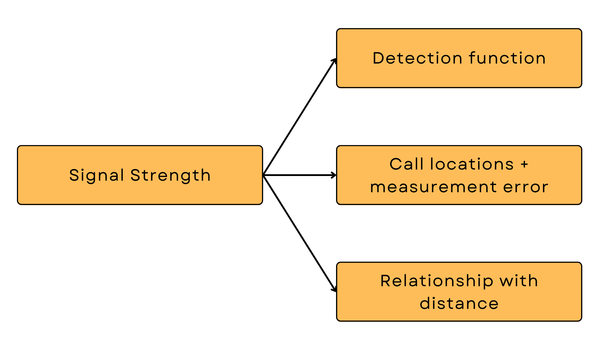
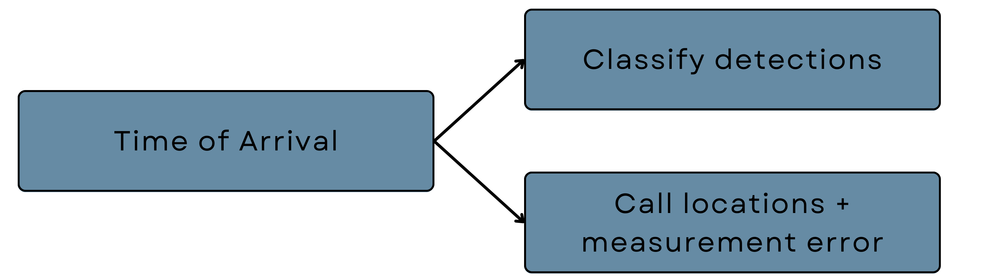

```{r setup6, include=FALSE}
knitr::opts_chunk$set(echo = TRUE)

library(learnr)
library(acre)
library(ggplot2)
library(kableExtra)
library(xfun)
library(secr)

```

## ASCR-CD with supplementary data 

Typically, aSCR studies record additional data, such as the strength of the recorded call (signal strength or SS) measured in, for example, decibels (dB). We can think of SS data as the loudness of a call. Other data, such as the time the call was recorded (time of arrival data or TOA) are also recorded. Signal strength is incorporated in our analysis in three ways.

```{r,echo=FALSE,out.width="50%", fig.align='center'}

```


Calls with stronger signal strengths are more likely to be detected than those with weaker strengths especially due to any ambient background noise in the recording. So signal strength is directly linked to making a detection and detection probabilities - in the same way as distance (smaller distance between a call location and detector means a higher detection probability).  We can incorporate the fact that detection probability depends on signal strength as well, by including a cutoff SS above which a call is considered a detection in our detection function. Then we are using a signal strength detection function. 

Signal strength data also helps our model to estimate the likely location of where a call was made. If a call was recorded at multiple detectors, the signal strength will be weaker at detectors which are further away from the call location. By including these measurements in our model, we increase the information with which our model can determine the likely location from where a call was made. Lastly, we can also model the relationship between SS and distance, and gain insight into how quickly signal strength decreases across the survey region. As well as the average signal strength of calls made super close to the detectors. 

Time of arrival data is used in two ways. They are typically used to classify the detections across microphones as belonging to the same call (this happens pre analysis after identifying the species calls). For the frog data, the authors classified detections as the same call if they were recorded within $d/330$ seconds from each other, where $d$ is the between the microphones in metres and 330 is the speed of sound in metres per second. 

```{r,echo=FALSE,out.width="50%", fig.align='center'}

```

aSCR literature has also shown that including TOA in our models also improves the precision with which we can estimate call locations. Here is a simple explanation. If one call arrives at microphone one, and then ten seconds later at microphone two, it's likely that the call was made closer to microphone one than two. Once again, including TOA data increases the amount of information our model can work with to estimate probable locations of the calls detected. 

For both data types, it is important that we take into account that we may not have measured them precisely, maybe due to the device itself or some external factors. Consequently, we don't assume that SS and TOA allow for perfect triangulation of the call location and we do so, by allowing for measurement error in our model. When including such supplementary data that may help in estimating call locations, our model will estimate a parameter which quantifies the measurement error for each variable included. For SS and TOA, we'll get an estimate of two such parameters, termed $\sigma_{ss}$ and $\sigma_{toa}$. 

### Data formating and model fitting 

Let's fit a ASCR-CD model with a SS detection function and TOA data. The measurements for these data are contained in the objects "signal_strength" and "time_of_arrival". SS and TOA data are not habitat covariates, they are additional detection information and so we include them in our captures dataframe. 

First, we are going to copy the captures dataframe into a new object called captures_ss_toa and then we are going to add the SS and TOA data in two separate columns called "ss" and "toa". 

```{r ss, exercise=TRUE,exercise.eval=FALSE}
# add to captures data frame 
captures_ss_toa <- captures

captures_ss_toa$ss <- signal_strength
captures_ss_toa$toa <- time_of_arrival

```

Using this captures dataframe, the same trap dataframe and the suggest buffer of 14, create and "acre_data" object with the $\texttt{read.acre()}$ function below. 

```{r ss_dat, exercise=TRUE,exercise.eval=FALSE}

# acre_data object 
lightf_ss_toa_data <- read.acre(
  
)

```

```{r ss_dat-hint}

lightf_ss_toa_data <- read.acre(
  captures = captures_ss_toa,
  traps = traps,
  control_create_mask = list(buffer = 14)
)

```

Now we are going to fit the model. When we supply the acre_data object with the ss and toa columns included in the captures dataframe, the acre model fitting function will automatically use them to estimate the call locations and estimate the measurement error parameters. The function will also automatically model the relationship between SS and distance. 

We have to specify the signal strength detection function just like we specified the halfnormal and we also have to specify the cutoff value we used for determining detections. For this data, the authors used a cutoff of 130 units. The cutoff is included in the **ss.opts** argument which has a similar structure as the **control_create_mask** argument. We create a list and then define the cutoff inside. 

```{r ss_mod, exercise=TRUE,exercise.eval=FALSE}

# model fitting 

model_ss_toa <- fit.acre(
  dat = lightf_ss_toa_data, 
  detfn = "ss", 
  ss.opts = list(cutoff = 130)
)

```

Have a look at the model output and the estimated detection function in the code block below.

```{r ss_mod_inf, exercise=TRUE,exercise.eval=FALSE}


```


```{r ss_mod_inf-hint}

summary(model2) # model summary 

show_detfn(model2) # detection functionn

```

The output looks quite different to the first model we fitted. The structure is the same but now we have some extra information and parameters. It starts off with the type of detection function, the number of sessions and then the type of information we included (Signal strengths and Time of arrival). The confidence interval method remains the same. 

Next we have the estimates. The first two estimates relate to the relationship between SS and distance which has been modeled using linear regression. If you'd like to know more about this statistical method which is super straightforward and easy to understand, have a look at the resources in the welcome page. For now, all you need to know is that the first parameter "b0.ss" is the average signal strength of a call made when distance is zero, i.e. when the individual was right by the recording device. The next parameter "b1.ss" quantifies the change in SS as distance increases. We know this relationship is negative, i.e. for every one unit increase in distance, the average SS decreases by roughly "b1.ss" amounts. 

The estimates for "sigma.ss" and "sigma.toa" are the measurement error parameters for SS and TOA, respectively. Lastly, we get the estimate of calling density.


